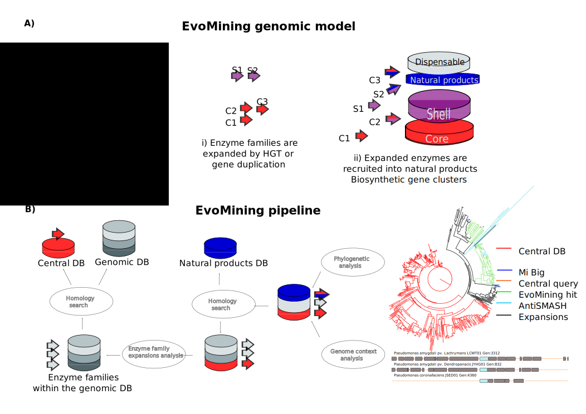
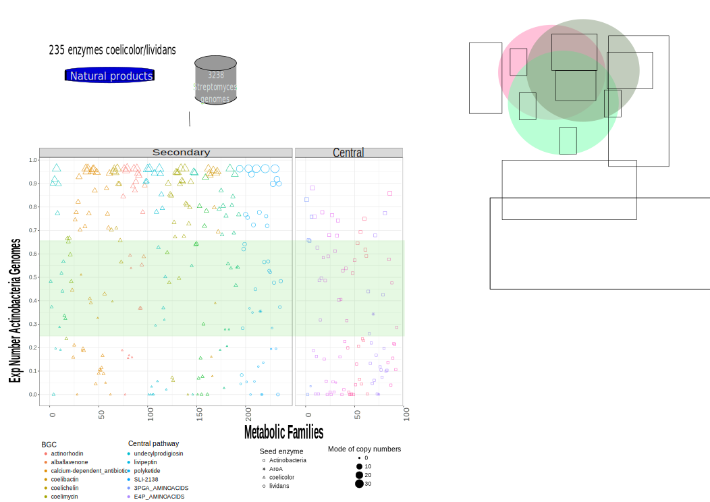
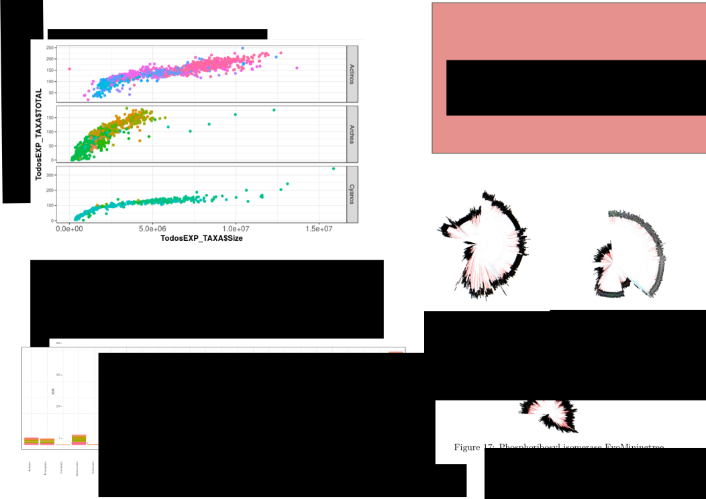
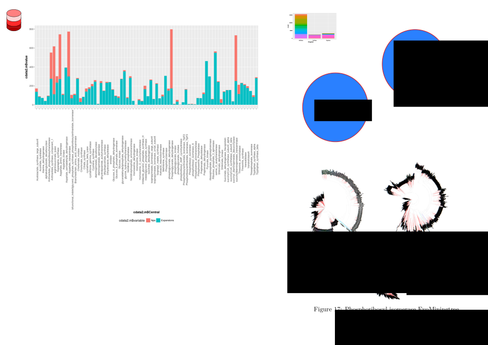

```{r setup, include=FALSE}
library(knitr)
knitr::opts_chunk$set(echo = TRUE)
```

```{r loading_tables_Actino,message=FALSE,echo=FALSE}
library(ggplot2)
library( reshape )
library(plyr ) 
library(RColorBrewer)
library(scales)
library(dplyr)
if(!require(devtools))
  install.packages("devtools", repos = "http://cran.rstudio.com")
if(!require(easyGgplot2))
  install_github("kassambara/easyGgplot2")
library(easyGgplot2)

hm.palette <- colorRampPalette(rev(brewer.pal(11, 'Spectral')), space='Lab')  
tropical=c('darkorange','dodgerblue','hotpink')
palette(tropical)


```

<!--codigo de evoMining display column even if only ceros, se despliega si le bajas el score a cero, pero quiero que se despliegue siempre-->
<!-- Plan
Figura 1 Figuras/EvoMiningPipeline.svg Metabolismo expansion
Figura 2 Figuras/GenomicDBS.svg Semana 2 Base genomica ->PriA
Figura 3 Figuras/TauDpseudomonas2.svg Base central -> TauD
Figura 4 Figuras/Backward.svg   Semana 1 AntiSMASH  
Figura 5 Figuras/PanCluster.svg  Semana 3  Poner los clusters de la nueva Familia  
-->
  
## Abstract  
<!-- Por qué son importantes los productos naturales  
Por qué es importante el genome mining en esta investigación  
Cómo se ha resuelto el problema hasta ahora  
Que aporta EvoMining  
Qué se hace en este estudio  
Cuáles son las perspectivas  -->

<!---
Microbial natural products has importance in human health and life. Due to the abundance of genomic and metagenomic data, new natural products research by genome mining is a growing field. Traditional genome mining  approaches explored bacterial genomes localizing marks of previously knwon secondary metabolism enzymes organized on biosynthetic gene clusters (BGCs). Here we present EvoMining a downloadable visual genome mining tool that incorporates evolution theory into genome mining. On EvoMining databases are customizable, its based on enzyme expansions not on BGCs. The advantage of this method is that every expanded enzyme family is a candidate to explore recruitments, and all prokatyiotic genome, even the unexplored Archaea kingdom. On this study EvoMining was applied to several database such as Cyanobacteria, Actinobacteria, Pseudomonas and Archaea studying expansions for enzyme families such as PriA,TauD and other enzymes recently recruited onto secondary metabolism. Finally the genomic plasticity of Streptomyces coelicolor known BGCs is explored generalizing/applying the open/Close pangenome approach to a BGCs. This Evolutionary methods open the door to discover not previously knwon chemical compounds at private genome collections and prioritize them according to their genomic plasticity.    
  --->
  
  
## Introduction  
<!--
- Productos Naturales  
- BGCs enzymas en los BGCs  
- software de priorizacion.  
- Bases de datos centrales en los que se ha explorado  Backward TauD,
- Bases de datos genómicas  TauD en Pseudomonas, Genomica de Archaea Cyanobacteria  
- Apertura y plasticidad de un genoma  
- Repetibilidad  y personalización permiten exploración.  
-->

<!---
Natural products are synthesized by biosynthetical gene clusters (BGCs) codified on the genome of a wide range of microorganisms. Enzymes that belong to a BGC can either be mainly restricted to secondary metabolism, or be a recent recruitment acting as accesory enzymes.  
With the genomic era and 500,000 prokaryotic genomes available at NCBI, there has been a oom of development of specilized genome mining software. Traditional approaches are based on recognize marks of enzymes devoted to secondary metabolism [@antismash], or domains [@clusterfinder] lattely Evolution [@arts nadine].   
On prokaryotic genomes enzyme families are expanded frequently either by duplication or by horizontal gene transfer and that this expansions are acting as evolutionary raw material being recruited into secondary metabolism to perform nobel chemical functionalities. A proof of concept of EvoMining idea was provided by the discovery of an arseno compound on Streptomyces coelicolor [@cruz-morales_phylogenomic_2016], nevertheless. 

Despite EvoMining analysis has recently being present on the natural products field [@blin_recent_nodate,@alanjary_antibiotic_2017,@ziemert_evolution_2016,@miller_interpreting_2017] EvoMining software has not been released, on this work we free EvoMining as a downloadable stand alone tool implemented on a docker container. EvoMining is free and open to all users and there is no login requirement. 
Despite Actinobacteria are great natural product producers [@omura] other microrganisms can be explored.  

Here we present the EvoMining expansions analysis using different genome-DB such as Actinobacteria, Cyanobacteria, Pseudomonas and Archaea. To enrich possibilities of central DB an example of what we called backward EvoMining was incorporated: BGCs from S coelicolor available at Mi-BIG were analyzed EvoMining backwards and all enzyme families expanded but not over represented were followed. 

Finally to prioritize which clusters possess more metabolite variations, assuming a link between genomic and metabolite plasticity we introduce the idea of classifying the saturation of a pangenome as open/closed pangenome measuring BGCs as open / closed BGC.    
--> 

##  Results and Discussion   

### Section 1 EvoMining 2.0 Updated model and pipeline   
EvoMining is a visual genome mining tool that following evolutionary principles has the milestone of prioritize non standard secondary metabolite pathways. The algorithm follows enzyme families from central pathways on their recruitment as components of natural products biosynthetic gene clusters (BGCs) within a genomic database. 
  
Figure1  
  
  
EvoMining inputs are a (1) a custom genomic database (genomic-DB), (2) a central pathways database (central-DB) and (3) a natural product database (natural-DB) composed of genes that belongs to experimentally tested BGCs. 
 These three databases are provided and can be modified, replaced and expanded by the user. In this work genomic-DB are  collection of up to date genomes in RAST format from taxonomically related organisms such as Actinobacteria, Cyanobacteria, Pseudomonas and Archaea. Selection of this taxa obeys to the possibility of comparing well known NPs producing organisms such as Actinobacteria and Cyanobacteria in contrast with Archaea that has been poorly investigated. The central-DB contains nine central pathways from Actinobacteria previously curated [@barona-gomez_what_2012], plus an update of seed metabolic enzymes identified after manual curation congruent with the central EvoMining paradigm.  The natural-DB currently comprises all sequences that belongs to some BGCs from The Minimum Information about a Biosynthetic Gene cluster (MIBiG) [@medema_minimum_2015].   

As output EvoMining identifies on the genomic-DB those expanded families from the central-DB that has at least a recruited member onto the natural-DB, proceeding then to the reconstruction of the evolutionary history of the enzyme family. Given an enzyme from the central-DB, the product of EvoMining analysis is a color coded tree of the expanded enzyme family that provides information about the metabolic fate. Specifically, enzymes from central metabolism are differentiated from known Natural Products enzymes and those expansions with potential activity into secondary metabolism are emphasised as putative novel recruitments. Further analysis of these hits allows visualization of the genomic vicinity guiding to the discovery of novel BGCs. In addition to the updates associated to the workflow of EvoMining, the version to be released will include the possibility of defining the dynamics of the gene content of any given BGC to explore the chemical plasticity related to EvoMining hits. This allows to prioritize which clusters possess more metabolite variations, therefore unmasking biosynthetic darkmatter (Medema and Fischbach 2015, Blin et al. 2017). 

EvoMining code and components (blast, muscle, FastTree, newick utilities, Gblocks,apache and SVG perl module) are wrapped on the docker container  nselem/newevomining downloadable at the Docker hub. Code is available at at github: nselem/EvoMining and manual at https://github.com/nselem/EvoMining/wiki. EvoMining tool will allow researchers to examine their own genomes and their own enzyme families in the search of expansions involved on nobel secondary metabolism.  

EvoMining will identify those expanded families of the central-DB within the genomic-DB that has at least a recruited member onto the natural-DB, proceeding then to the reconstruction of the evolutionary history of the enzyme family. Given an enzyme from the central-DB, the product of EvoMining analysis is an interactive color coded tree of the enzyme expanded family where best bidirectional hits (BBH) of central-DB are differentiated from Natural Products members and those expansions close to a Natural Product sequence that are not BBH with central-DB enzymes are emphasised as putative nobel recruitments into secondary metabolism.   
EvoMining algorithm was used before with 230 Actinobacteria 106 central families, nvertheless  
Genomic DB  

Feature           EvoMining 1                   EvoMining 2                    Novel insights
--------------   ----------------------------   ------------------------      ------------------------  
Code                                                                  
                  Consulting web site           Standalone docker tool    
Databases      
                  Fixed                         Customizable                     
Genomic-DB     
                  Actinobacteria 230 genomes    Actinobacteria 1245 genomes   EvoMining predictions are lineage dependnet                    
                                                Cyanobacteria 416 genomes       
                                                Archaea 876 genomes  
Central-DB                                 
                  Actinobacteria 106 families   Actinobacteria 106 families                  
                                                Cyanobacteria  81 families      
                                                Archaea 80 families  
                                                RetroEvoMining XX num
Natural-DB                                                                                                    
                  Manual curation               MiBIG
                               
---------------  ----------------------------   -------------------    
  
  <!-- *Repetir  de las 93  a 106-->  
### From 

235 Enzymes from BGC clusters were tested 
55 reduced  
56 intermediate  
124 Super  

  
3.2(Backward Evening)    
Coelicolor clusters  

$ExNum =1- \frac{Orgs}{Copies}$

where Orgs stands for organisms with at least one copy and copies is the total number of copies on that family on the genomic-DB

Esto se hará solo sobre Streptomyces de los 1246  

HERE TABLE WITH CLUSTERS
```{r CoelicolorMiBig, warnings = FALSE, message = FALSE,echo=FALSE}
table <- read.csv("Figuras/CoelicolorMiBIG", row.names = 1,sep="\t")
kable(table,  caption = "Coelicolor\\label{tab:Coelicolor MiBig}",caption.short = "CoelicolorMiBig ")
```
     

```{r ExpNumber,warnings = FALSE, message = FALSE,echo=FALSE, results='hide'}
# Expansions of enzyme sequences from MiBIG from S coelicolor will be explored within the scope of the genomic database Streptomyces. The goal is to recover those enzymes that are not yet been considered as common on secondary metabolism. 
## Moda is the most common copy number on an organism, Organisms with an extra copy are the ones that may have this copy recrutied into secondary metabolism
# This extra copy on at least 4 organismos
## In addtiion the distribution of the enzyme is desired to be present on at least half o the organisms (Not to exclusive)
## Too exclusive means only belong to secondary metabolism, we are looking for switches  
## looking for an esay number between 0 and one that reflects too expanded, too exclusive
#  y el exp number,  mas entre .2<= Exp <=.6 y analizar eso árboles.  
# One minus average organisms that contains one copy.
# More copies than organisms this number tends to one   ## too expanded
# few copies  on homogeneously on few organisms tends to cero ## too particular  
# two copies by organism .5  , that is not usually the case  because there is some variance 


######### Functions   
OneOrMode <- function(x){ #max between 0 and one
a = table(x) # x is a vector
moda=a[which.max(a)]
inte=max(1,as.integer(names(moda)))
return(inte)
}
Mode <- function(x){ ## mode
a = table(x) # x is a vector
moda=a[which.max(a)]
inte=as.integer(names(moda))
return(inte)
}
OrganismsExtraCopy <- function(x){ ##how many organisms has an extra copy than the mode
  a = table(x) # x is a vector  
  moda=a[which.max(a)]
  inte=as.integer(names(moda)) #the moda
  subx<-as.integer(a[which(as.integer(names(a))>inte)]) ## vector of organisms with extra copies
  suma<-sum(subx) ## how many
return(suma)
}
OrgAtLeastOneCopy <- function(x){ ##how many organisms has at least one copy 
  a = table(x) # x is a vector  
  subx<-as.integer(a[which(as.integer(names(a))>0)]) ## vector of organnisms with at least one copy
  suma<-sum(subx) ## how many
return(suma)
}
Copies <- function(x){ ##how many organisms has an extra copy than the mode
  suma<-sum(x,na.rm = TRUE) ## how many
return(suma)
}

######## Reading and sorting data   
## Read enzyme names. origin(Central/Coelicolor/lividans) and BGC from MiBIG
CoelicolortableExp <- read.csv("Figuras/CoelicolorExpansionBlast.data", header=TRUE, sep="\t")  ### Enzyme BGC Function from MiBIG coelicolor
LividanstableExp <- read.csv("Figuras/LividansExpansionBlast.data", header=TRUE, sep="\t")  ### Enzyme BGC Function from MiBIG coelicolor
tableCentral <- read.csv("Figuras/Central.data", header=TRUE, sep="\t")  ### Enzyme Subsystem Function from central metabolism  
CoelicolortableExp$Org<-"coelicolor"
LividanstableExp$Org<-"lividans"
tableExp<-rbind(CoelicolortableExp,LividanstableExp)
rownames(tableExp) <- tableExp[,1]

## Read EvoMining tables (head plots)
tableDistribution <- read.csv("Figuras/CoelicolorEnzymes.Distribution", header=TRUE, row.names=1,sep="\t")  ### Expansions from coelicolor (Heat plot score 0)
LivitableDistribution <- read.csv("Figuras/LiviEnzymes.Distribution", header=TRUE, row.names=1,sep="\t")  ### Expansions from coelicolor (Heat plot score 0)
tableCentralDistribution <- read.csv("Figuras/CentralEnymes.Distribution.csv", header=TRUE, row.names=1,sep="\t") #Expansions from 93 enzimas central metabolism   
tableNaturalDistribution<- merge(LivitableDistribution, tableDistribution, by=0, all=TRUE) 

rownames(tableNaturalDistribution) <- tableNaturalDistribution[,1]
tableNaturalDistribution$Row.names<-NULL
#str(tableNaturalDistribution)

#tableNaturalDistribution$Enzyme_74
#LivitableDistribution$Enzyme_74
#tableDistribution$Enzyme_74

## both lividans and coelicolor are in one table now   
  
#necesito poner el valor de names de moda en el renglon con el mismo valor en enzima
#number of organisms greater than mode  at least tenpercent of the genome
##Reducing CoelicolortableExp to those I have distribution

tableExp=tableExp[tableExp$Enzyme %in% names(tableNaturalDistribution),]
##str(tableExp)
tableExp <- tableExp[order(tableExp$Enzyme),] ## Sort rows by enzyme
##str(tableExp)
tableNaturalDistribution <- tableNaturalDistribution[,order(names(tableNaturalDistribution))] #Sort columns by table Natural distribution  


################# Processing functions BGC data  
modaOrOne=apply(tableNaturalDistribution,2, OneOrMode)  ##minimum 1 or moda
moda=apply(tableNaturalDistribution,2, Mode) ## moda
ExtraCopy=apply(tableNaturalDistribution,2, OrganismsExtraCopy) ## HOw many extra copies are 
OneCopy=apply(tableNaturalDistribution,2, OrgAtLeastOneCopy)
CopiesEvo=apply(tableNaturalDistribution,2, Copies)
Average=colMeans(tableNaturalDistribution,na.rm = TRUE)

#necesito poner el valor de names de Average en el renglon con el mismo valor en enzima en tableExp
tableExp<-tableExp[match(names(Average), tableExp$Enzyme),]
tableExp$Average<-Average
#Average["Enzyme_215"]
#tableExp["Enzyme_215","Average"]
#tableExp["Enzyme_215","Function"]

tableExp<-tableExp[match(names(moda), tableExp$Enzyme),]
tableExp$Moda<-moda
tableExp["Enzyme_215","Moda"]

tableExp<-tableExp[match(names(ExtraCopy), tableExp$Enzyme),]
tableExp$ExtraCopy=ExtraCopy
ExtraCopy["Enzyme_215"]
tableExp["Enzyme_215","ExtraCopy"]

tableExp<-tableExp[match(names(OneCopy), tableExp$Enzyme),]
tableExp$OneCopy=OneCopy
OneCopy["Enzyme_215"]
tableExp["Enzyme_215","OneCopy"]

tableExp<-tableExp[match(names(CopiesEvo), tableExp$Enzyme),]
tableExp$CopiesEvo=CopiesEvo
CopiesEvo["Enzyme_215"]
tableExp["Enzyme_215","CopiesEvo"]

################# Processing functions central data  
 CentralmodaOrOne=apply(tableCentralDistribution,2, OneOrMode)
Centralmoda=apply(tableCentralDistribution,2, Mode)
CentralExtraCopy=apply(tableCentralDistribution,2, OrganismsExtraCopy)
CentralOneCopy=apply(tableCentralDistribution,2, OrgAtLeastOneCopy)
CentralCopiesEvo=apply(tableCentralDistribution,2, Copies)
CentralAverage=colMeans(tableCentralDistribution)

tableCentral<-tableCentral[match(names(Centralmoda), tableCentral$Enzyme),]
tableCentral$Moda=Centralmoda
tableCentral<-tableCentral[match(names(CentralAverage), tableCentral$Enzyme),]
tableCentral$Average=CentralAverage
tableCentral<-tableCentral[match(names(CentralExtraCopy), tableCentral$Enzyme),]
tableCentral$ExtraCopy=CentralExtraCopy
tableCentral<-tableCentral[match(names(CentralOneCopy), tableCentral$Enzyme),]
tableCentral$OneCopy=CentralOneCopy
tableCentral<-tableCentral[match(names(CentralCopiesEvo), tableCentral$Enzyme),]
tableCentral$CopiesEvo=CentralCopiesEvo


tableExp$ExpNum=1-tableExp$OneCopy/tableExp$CopiesEvo
tableCentral$ExpNum=1-tableCentral$OneCopy/tableCentral$CopiesEvo


tableExp<-tableExp[order(tableExp$Order),]
#tableCentral$Order=tableCentral$Order+193
tableCentral$Order
tableCentral<-tableCentral[order(tableCentral$Order),]
tableEnzymeReduced=subset(tableExp,tableExp$ExpNum<.2 )
str(tableEnzymeReduced)
tableEnzymeIntermediate=subset(tableExp,tableExp$ExpNum<=.6 & tableExp$ExpNum>= .2 )
str(tableEnzymeIntermediate)
tableEnzymeSuper=subset(tableExp,tableExp$ExpNum>.6)
str(tableEnzymeSuper)


tableExp[215,"Org"]<-"AroA"
LivitableDistribution$Enzyme_215

tableCentral$Org<-"Actinobacteria"
tableCentral[69,"Org"]<-"AroA"
tableCentral[69,"Function"]

total <- rbind(tableExp,tableCentral)
todosImage<-ggplot(total,aes(x=total$Order, y=total$ExpNum,  color=total$BGC, size = total$Moda, shape=total$Org))+facet_wrap(~ total$Type)+ geom_point() + labs(x = "Metabolic Families", y = "Exp Number Actinobacteria Genomes",text = element_text(size=12)) + theme_bw()+theme(plot.title = element_text(size = 20, face = "bold"), text = element_text(size = 14), axis.title = element_text(face="bold"), axis.text.x=element_text(angle = 90,size = 16), legend.position = "right")+ scale_shape_manual(values = c(0, 8, 2, 1))+ scale_y_continuous(breaks=c(0,.1, .2,.3,.4,.5, .6,.7,.8,.9,1))
  ggsave(file="Figuras/todosImage.svg", plot=todosImage, width=20, height=8)

ggplot(total,aes(x=total$Order, y=total$ExpNum,  color=total$BGC, size = total$Moda, shape=total$Org))+facet_wrap(~ total$Type)+ geom_point() + labs(x = "Metabolic Families", y = "Exp Number Actinobacteria Genomes",text = element_text(size=12)) + theme_bw()+theme(plot.title = element_text(size = 20, face = "bold"), text = element_text(size = 14), axis.title = element_text(face="bold"), axis.text.x=element_text(angle = 90,size = 16), legend.position = "right")+ scale_shape_manual(values = c(0, 8, 2, 1))+ scale_y_continuous(breaks=c(0,.1, .2,.3,.4,.5, .6,.7,.8,.9,1))

#str(CoelicolortableExp)
#CoelicolortableExp$Enzyme
## ploting images
  #############################################################################################################################################
require("svglite")

  imageCentral= ggplot(tableCentral,aes(x=tableCentral$Order, y=tableCentral$ExpNum, color=tableCentral$BGC, size = tableCentral$Moda))+ geom_point() + labs(x = "Metabolic Families", y = "Exp Number Actinobacteria Genomes",text = element_text(size=12)) + theme_bw()+theme(plot.title = element_text(size = 20, face = "bold"), text = element_text(size = 14), axis.title = element_text(face="bold"), axis.text.x=element_text(angle = 90,size = 16), legend.position = "right")
  
  ggplot(tableCentral,aes(x=tableCentral$Order, y=tableCentral$ExpNum, color=tableCentral$BGC, size = tableCentral$Moda))+ geom_point() + labs(x = "Metabolic Families", y = "Exp Number Actinobacteria Genomes",text = element_text(size=12)) + theme_bw()+theme(plot.title = element_text(size = 20, face = "bold"), text = element_text(size = 14), axis.title = element_text(face="bold"), axis.text.x=element_text(angle = 90,size = 16), legend.position = "right")
  ggsave(file="imageCentral.svg", plot=imageCentral, width=20, height=8)

    
### Aqui aquellas que no tenian tantos reclutamientos/expansions
 figura1<-ggplot(tableEnzymeReduced,aes(x=tableEnzymeReduced$Order, y=tableEnzymeReduced$ExpNum, color=tableEnzymeReduced$BGC, size = tableEnzymeReduced$Moda))+ geom_point() + labs(x = "Metabolic Families", y = "Exp Number Actinobacteria Genomes",text = element_text(size=12)) + theme_bw()+theme(plot.title = element_text(size = 20, face = "bold"), text = element_text(size = 14), axis.title = element_text(face="bold"), axis.text.x=element_text(angle = 90,size = 16), legend.position = "right")

 
    
StreptoNp <- read.table("Figuras/naturalProductsEnzymeReduced.data", header=TRUE, sep="\t")


figura2<-qplot(x=Central, data=StreptoNp, geom="bar", fill=kingdom, position="stack")+theme_bw()+ theme(legend.position	="bottom",text = element_text(size=8), axis.text.x = element_text(angle = 90, hjust = 1, vjust = 0.5) ,axis.text.y = element_text(angle = 0, hjust = 1, vjust = 0.5) )

figura3<-qplot(x=Central, data=StreptoNp, geom="bar", fill=taxa, position="stack")+theme_bw()+ theme(legend.position	="bottom",text = element_text(size=8), axis.text.x = element_text(angle = 90, hjust = 1, vjust = 0.5) ,axis.text.y = element_text(angle = 0, hjust = 1, vjust = 0.5) )

#mm<-count(StreptoNp$Central)
#small<-mm[which(mm$freq<50),]
#str(mm)

#StreptoNpSmall=StreptoNp[StreptoNp$Central %in% small$x,]
#StreptoNp$Central %in% small$x

#qplot(x=Central, data=StreptoNpSmall, geom="bar", fill=kingdom, position="stack")+theme_bw()+ theme(legend.position	="bottom",text = element_text(size=8), axis.text.x = element_text(angle = 90, hjust = 1, vjust = 0.5) ,axis.text.y = element_text(angle = 0, hjust = 1, vjust = 0.5) )

#qplot(x=Central, data=StreptoNpSmall, geom="bar", fill=taxa, position="stack")+theme_bw()+ theme(legend.position	="bottom",text = element_text(size=8), axis.text.x = element_text(angle = 90, hjust = 1, vjust = 0.5) ,axis.text.y = element_text(angle = 0, hjust = 1, vjust = 0.5) )


#kable(CoelicolortableExp,  caption = "CoelicolorExpansions\\label{tab:Coelicolor Expansions}",caption.short = "CoelicolorExpansions")
```

Presence Absence
EvoMining was run over enzymes with expansion number between .1 and .6
Figuras/GenomicDBS.svg


### Section 2  Update and insights from genomic databases   
  

El reclutamiento de una enzima en una ruta de metabolismo secundario 
The expansioness of a family depends on the clade.  
Expansions are correlated with genome side, at different velocities, not linearly, Archaea Bacteria are smaller in size until now, Cyanobacteria correlation is weaker.  
  
#### 2a Lineage specific  
  <!--Poner juntos cyanos Archea, marcar por forma orden favorito -->


```{r GenomicDatabase,warnings = FALSE, message = FALSE,echo=FALSE, results='hide'}
######################## Loading data  
ArchaeasCentral <- read.table("../chapter3/ArchaeasCentral", header=TRUE, sep="\t")
ArchaeasHeatPlot <- read.table("../chapter3/ArchaeasHeatPlot", header=TRUE, sep="\t")
ArchaeasNp <- read.table("../chapter3/ArchaeasNp", header=TRUE, sep="\t")
ArchaeasSMASH <- read.table("../chapter3/ArchaeasSMASH", header=TRUE, sep="\t")
ArchaeasTaxa <- read.table("../chapter3/ArchaeasTaxa", header=TRUE, sep="\t")
ArchaeasTaxa$Kingdom<-"Archea"
ArchaeasSMASH$Kingdom<-"Archea"

ActinosCentral <- read.table("../chapter4/ActinoCentral", header=TRUE, sep="\t")
ActinosHeatPlot <- read.table("../chapter4/ActinoHeatPlot", header=TRUE, sep="\t")
ActinosNp <- read.table("../chapter4/ActinoNp", header=TRUE, sep="\t")
ActinosSMASH <- read.table("../chapter4/ActinosSMASH", header=TRUE, sep="\t")
ActinosTaxa <- read.table("../chapter4/ActinoTaxa", header=TRUE, sep="\t")
ActinosTaxa$Kingdom<-"Actinos"
ActinosSMASH$Kingdom<-"Actinos"
ActinosTaxa$SuperPhylum<-"Actinos"

CyanosCentral <- read.table("../chapter5/CyanosCentral", header=TRUE, sep="\t")
CyanosHeatPlot <- read.table("../chapter5/CyanosHeatPlot", header=TRUE, sep="\t")
CyanosNp <- read.table("../chapter5/CyanosNp", header=TRUE, sep="\t")
CyanosSMASH <- read.table("../chapter5/CyanosSMASH", header=TRUE, sep="\t")
CyanosTaxa <- read.table("../chapter5/CyanosTaxa", header=TRUE, sep="\t")
CyanosTaxa$Kingdom<-"Cyanos"
CyanosSMASH$Kingdom<-"Cyanos"
CyanosTaxa$SuperPhylum<-"Cyanobacteria"
########################### End of loading data
#str(ActinosTaxa) #1245
#str(CyanosTaxa) #416
#str(ArchaeasTaxa) #876

#################################################################
## Joining data frames heat plot and taxa
TodosTaxa<-rbind(ArchaeasTaxa,CyanosTaxa,ActinosTaxa)

#names(ArchaeasHeatPlot)
#intersect(names(CyanosHeatPlot),names(ActinosHeatPlot))

#intersect(intersect(names(CyanosHeatPlot),names(ActinosHeatPlot)),names(ArchaeasHeatPlot))
ArHP<-ArchaeasHeatPlot[,intersect(intersect(names(CyanosHeatPlot),names(ActinosHeatPlot)),names(ArchaeasHeatPlot))]
CyHP<-CyanosHeatPlot[,intersect(intersect(names(CyanosHeatPlot),names(ActinosHeatPlot)),names(ArchaeasHeatPlot))]
AcHP<-ActinosHeatPlot[,intersect(intersect(names(CyanosHeatPlot),names(ActinosHeatPlot)),names(ArchaeasHeatPlot))]
TodosHP<-rbind(ArHP,CyHP,AcHP)
TodosEXP_TAXA<-merge(TodosHP,TodosTaxa,by.x="RastId",by.y="RastId")

#str(TodosHP)
####  End of joining dataframes
##########################################################################################################
##########################################################################################################
##########################################################################################################
################# Graphs 
#########################################################################################################

#########################################################################################################
## 1) Genome Size vs central expansion by facets 
GenomeSizeVsCentralExpansion<-qplot(TodosEXP_TAXA$Size, TodosEXP_TAXA$TOTAL, data = TodosEXP_TAXA,colour=TodosEXP_TAXA$Order)+facet_grid(TodosEXP_TAXA$Kingdom~.,scales="fixed")+theme_bw()+ theme(legend.position	="bottom",plot.title = element_text(size = 24, face = "bold"),text = element_text(size = 12),axis.title = element_text(face="bold"),axis.text.x=element_text(size = 20),axis.text.y=element_text(size = 16)) +labs(x = "Genome size (bp)",    y = "Total number of expansions from central families",colour="Order" )
ggsave(file="Figuras/GenomeSizeVsCentralExpansion.svg", plot=GenomeSizeVsCentralExpansion, width=10, height=10)
## End genome size vs central expansion  
##########################################################################################################


#############################################################################################################################
## 2) Box plot Expansiones familia y point Genome 
TodosHP$RastId <- with(TodosHP, reorder(TodosHP$RastId, TodosHP$TOTAL))
TodosHP.m <- melt(TodosEXP_TAXA,id = c("RastId","Kingdom","Name","SuperPhylum","Phylum","Class","Order","Family","Contigs","Size","RastNo"))
TodosHP.m<-subset(TodosHP.m,variable!="TOTAL")
#CyanosHeatPlot$RastId <- with(CyanosHeatPlot, reorder(CyanosHeatPlot$RastId, CyanosHeatPlot$TOTAL))
#CyanosHeatPlot.m <- melt(CyanosHeatPlot)
#CyanosHeatPlot.m<-subset(CyanosHeatPlot.m,variable!="TOTAL")
##   Boxplot expansiones en familias en colores por reinos
BoxCentralFamilies<-ggplot(TodosHP.m, aes(x=TodosHP.m$variable, y=TodosHP.m$value,color=TodosHP.m$Kingdom)) +labs(x = "Metabolic Families", y = "Copy number on Genomes",text = element_text(size=12)) + geom_boxplot()+theme_bw()+theme(plot.title = element_text(size = 14, face = "bold"), text = element_text(size = 12), axis.title = element_text(face="bold"), axis.text.x=element_text(angle = 90,size = 10), legend.position = "bottom")
####ggsave(file="BoxCentralFamilies.svg", plot=BoxCentralFamilies, width=30, height=8)
############### End of boxplot   
##########################################################################################################


######## 3) NOT READY Diversity of antiSMASH detection on 3 genomic DBs
CyanosSMASH.m <- melt(CyanosSMASH,id = c("RastId","Kingdom"))  
CyanosSMASH.m<-CyanosSMASH.m[(CyanosSMASH.m$value!=0)&(CyanosSMASH.m$value!="Cyanos")&(CyanosSMASH.m$variable!="TOTAL"),]
ArchaeasSMASH.m <- melt(ArchaeasSMASH,id = c("RastId","Kingdom"))  
ArchaeasSMASH.m<-ArchaeasSMASH.m[(ArchaeasSMASH.m$value!=0)&(ArchaeasSMASH.m$value!="Archea")&(ArchaeasSMASH.m$variable!="TOTAL"),]
ActinosSMASH.m <- melt(ActinosSMASH,id = c("RastId","Kingdom"))  
ActinosSMASH.m<-ActinosSMASH.m[(ActinosSMASH.m$value!=0)&(ActinosSMASH.m$value!="Actinos")&(ActinosSMASH.m$variable!="TOTAL"),]
Todos_SMASH<-rbind(ActinosSMASH.m,CyanosSMASH.m,ArchaeasSMASH.m)
DiversitySMASH<-ggplot2.barplot(data=Todos_SMASH, xName="Kingdom",  groupName="variable",showLegend=FALSE)

####ggsave(file="DiversitySMASH.svg", plot=DiversitySMASH, width=30, height=8)

## HACEr una funcion con la diversidad de Archaea 
#lista<-list(CyanosSMASH,ArchaeasSMASH,ActinosSMASH)
#lista<-list(NonZeroCyanos,NonZeroArchaeas,NonZeroActinos)
#TODOS_SMASH<-bind_rows(lista)
#aver<-TODOS_SMASH[TODOS_SMASH$RastId=="389046",]$TOTAL
#aver
#2 Tener boxplot de expansiones por familia por kingdom LISTOOO
#3 Escoger una familia para analizar a detalle por genero y poner sus árboles  PriA por ejemplo  

## Good code but not in use  
#names(CyanosSMASH)
#intersect(names(CyanosSMASH),names(ArchaeasSMASH))
#nonzero <- function(x) sum(x != 0)
#NonZeroCyanos<-numcolwise(nonzero)(CyanosSMASH)
#NonZeroArchaeas<-numcolwise(nonzero)(ArchaeasSMASH)
#NonZeroActinos<-numcolwise(nonzero)(ActinosSMASH)
#union( union(names(CyanosSMASH),names(ArchaeasSMASH)),names(ActinosSMASH))
#union( union(names(NonZeroCyanos),names(NonZeroArchaeas)),names(NonZeroActinos))

################## Init Figura antiSMASH propuesta por Paco Simil paper EvoMining  
# Previous                            #     Current      
#Genomic DB 230 genomas               #     Genomic DB   1245 genomes
# Central 106 families                #     Central 93 families 
# 226 BGCs                            #     1296 BGCs with 44552 enzymes
# Previous results            ######################################
# 101 expandidas                      #     93 Expansions, O bien 80 si consideramos solo expansiones on at least 1% (12.45) of organisms # Expandidas en coelicolor 33
# 23 enzimas con reclutamientos       #      82 ?? Recruitments  11 non recruitments 76 according to dataframe. 

## plan para replicar la figura CONSULTAR CON PACO Qué familias   
## Hacer un script que obtenga los BBH de las central con cada familia expandida 
## De los que nos son BBH cuales son antiSMASH /Cluster Finder  
## Cuales son MIBIG  
## Cuales no son nada.  

## I´m starting with Actinobacteria  
## 1) Identifying Familis with expansions  
## ActinosHeatPlot Has the hits    
 ## Now need a function how many organisms has expansions and in total how many expansions are from the 95 families  
#compare two vectors if ai > bi then 1 
ActinosHP <-ActinosHeatPlot
str(ActinosHP)
rownames(ActinosHP) <- ActinosHeatPlot[,1]
  HeatAverage=colMeans(ActinosHP)
  HeatSD=apply(ActinosHP, 2, sd)
ExpTresHold<-HeatAverage+HeatSD

### Coelicolor expansions   
Coelicolor<-ActinosHP["242137",]
names(Coelicolor)
Coelicolor<-Coelicolor[!names(Coelicolor) %in% c("TOTAL","RastId")]
ExpTresHold2<-ExpTresHold[!names(ExpTresHold) %in% c("TOTAL","RastId")]
CoeliExpansions<-Coelicolor>ExpTresHold2
CoeliExpansionsTotal<-sum(CoeliExpansions) ## how many expansions
CoeliExpansionsTotal ## 34
CoeliExpansionsFamilies<-Coelicolor[CoeliExpansions]## which families are expanded   
CoeliExpansionsFamilies
CoeliExpansionsFamilies<-names(Coelicolor)[CoeliExpansions]## which families are expanded   
CoeliExpansionsFamilies
########### End coelicolor expansions 

############## starting families exapnsions 
ExpTresHold$RastId<-"Treshold"

ActinosHP<-rbind (ActinosHP, ExpTresHold)  

FamiliesExpanded <- function(x){ ## is a column
  ultimo<-tail(x, n=1)
  subx<-x>ultimo ## vector of organisms with extra copies
  suma<-sum(subx) ## how many
return(suma)
}

ExpandedFamilies=apply(ActinosHP,2, FamiliesExpanded)  
ExpandedFamilies<-ExpandedFamilies[!names(ExpandedFamilies) %in% c("TOTAL","RastId")]
str(ExpandedFamilies)
nonzero <- function(x) sum(x != 0)
zero <- function(x) sum(x == 0)
Atleast1Percent<- function(x) sum(x >12.45)  

NonZeroExpandedFamilies<-nonzero(ExpandedFamilies)
ZeroExpandedFamilies<-zero(ExpandedFamilies)
Percent1ExpandedFamilies<-Atleast1Percent(ExpandedFamilies)
ZeroExpandedFamilies
NonZeroExpandedFamilies
Percent1ExpandedFamilies

ExpandedFamilies["Phosphoglycerate_dehydrogenase"]
#qplot(1:length(ExpandedFamilies), ExpandedFamilies, xlab ="Families") + geom_line()
FiguraExpanded<-qplot(names(ExpandedFamilies), ExpandedFamilies, xlab ="Families") + geom_line()+theme(plot.title = element_text(size = 14, face = "bold"), text = element_text(size = 12), axis.title = element_text(face="bold"), axis.text.x=element_text(angle = 90,size = 10), legend.position = "bottom")

### Ahora quien de estas familias tienen reclutamientos   
## Quiero grafica familia vs #reclutamientos 
ActinosNpReduced<-subset(ActinosNp,ActinosNp$np!="none")
cdata <- ddply(ActinosNpReduced, "Central", summarise,Nps  = length(np))
rownames(cdata) <- cdata[,1]
names(ExpandedFamilies)
row.names(cdata)

## Eliminar los 11 nones
ExpandedAndRecruited<-intersect(names(ExpandedFamilies),row.names(cdata))
cdata2<-subset(cdata,row.names(cdata) %in% ExpandedAndRecruited)
ExpandedFamilies2<-ExpandedFamilies[names(ExpandedFamilies) %in% ExpandedAndRecruited]
cdata2<-cdata2[match(names(ExpandedFamilies2), cdata2$Central),]
cdata2$Expansions=ExpandedFamilies2  
cdata2.m<- melt(cdata2,id = c("Central"))

##### Solo me falta graficar  
figure<-ggplot(cdata2.m, aes(x = cdata2.m$Central, y = cdata2.m$value, fill = cdata2.m$variable))+ geom_bar(stat = "identity")+theme(plot.title = element_text(size = 14, face = "bold"), text = element_text(size = 12), axis.title = element_text(face="bold"), axis.text.x=element_text(angle = 90,size = 10), legend.position = "bottom")

### ggplot2.barplot(data=cdata2.m, xName="Central",  groupName="value")
#cdata
#summary(ActinosNp)
## Quito none, interseccion y stack bar

#qplot(x=Central, data=ActinosNp, geom="bar", fill=np, position="stack")+theme_bw()+ theme(legend.position	="none",text = element_text(size=8), axis.text.x = element_text(angle = 90, hjust = 1, vjust = 0.5) ,axis.text.y = element_text(angle = 0, hjust = 1, vjust = 0.5) )

```

  
#### 2b Diversity on central Families according to the lineage  
  
<!-- this is the code for GenomicDiversity Figure-->
```{r Figure_Pablo2 ,warnings = FALSE, message = FALSE,echo=FALSE, results='hide'}
  
#  1) Every BBH: (BBH Totales) Directly from blast not all of this sequences will go to EvoMining heat plot due to EvoMining restriction
#  perl GetBBH.pl vueltaArcheas.blast.bbh |sort
#  output *.bbh
#  on excell sort families alphabetically 
  
#  2) Family Number From evoMiningHeatmap  ##Fallo, cyanos heatplot revisar correctos
#  Crear archivo vi Central.numbers
#  ls *central|sort -g |while read line; do fam=$(head -n1 $line|cut -d'|' -f3|rev  | cut -d'_' -f2- | rev);num=$(echo $line|cut -d'.' -f1);echo -e $num'\t'$fam; done>Central.numbers
      
#  3) All sequences on tree but oranges (TOTALTree)  
#  ls *concat.fasta |sort -g|while read line; do num=$(grep '>' $line|sort|uniq|wc); echo $line $num; done|cut -d' ' -f1,2   
#  concat contains cyan, black and red leaves but not the oranges  
  
#  4) candidates to BBH on tree first red colored  (FirstRED)
#  perl GetBBHonTree.pl Central.numbers  
#  output .bbh.tree  
  
#  5) AntiSMASH on sequences on tree  CYAN  
#   Ids antiSMASH file  
#   cut -f2 Archeas_Smash |sort >Archeas_Smash_F1  
#   Ids list ls *concat.fasta|sort -g |while read line; do grep '>' $line|cut -d'|' -f2 |sort >$line.ids; done  
#   ls *ids |sort -g |while read line; do comm -12 Archeas_Smash_F1 $line>$line.smash; done  
#   output .smash
#   ls *smash|sort -g |while read line; do num=$(wc -l<$line);echo -e $num'\t'$line; done
   
   
#  6) AntiSMASH on BBH on tree (AntiSMASHonTree) CYAN_OVER_RED
#    perl GetBBHonTreeAndonSmash.pl Central.numbers  
#    Output .bbh_smash

#  7) Blue MiBig BLUE
# seq 81|while read line; do if [ -f $line.fasta_ExpandedVsNp.blast.2.recruitedUniq ];  then num=$(wc -l <$line.fasta_ExpandedVsNp.blast.2.recruitedUniq);  else num=0; fi; echo -e $line'\t'$num; done
#   Non existent files are 0 hits
   
 # 8) Orange leaves (Central seeds/queries) ORANGE
 #    ls *central |sort -g | while read line; do num=$(grep '>' $line |sort|uniq |wc); echo $line $num; done  
 #    RED=FirstRED-CYAN_OVER_RED  
 #    BLACK=TOTALTree-RED-CYAN-BLUE  
       
  
ActinosColors <- read.table("ACTINOS/Actinos.Central.Colors", header=TRUE, sep="\t")
ActinosColors$Kingdom<-"Actinos"
ActinosColors$Red_Final<-ActinosColors$FirstRED-ActinosColors$CYAN_OVER_RED  
ActinosColors$Cyan_Cyan<-ActinosColors$CYAN -ActinosColors$CYAN_OVER_RED  
ActinosColors$Black<-ActinosColors$TOTALTree-(ActinosColors$CYAN+ActinosColors$Red_Final+ActinosColors$Azul_NP)

CyanosColors <- read.table("CYANOS/Cyanos.Central.Colors", header=TRUE, sep="\t")
CyanosColors$Kingdom<-"Cyanos"
CyanosColors$Red_Final<-CyanosColors$FirstRED-CyanosColors$CYAN_OVER_RED  
CyanosColors$Cyan_Cyan<-CyanosColors$CYAN -CyanosColors$CYAN_OVER_RED  
CyanosColors$Black<-CyanosColors$TOTALTree-(CyanosColors$CYAN+CyanosColors$Red_Final+CyanosColors$Azul_NP)  
  
ArchaeasColors <- read.table("ARCHAEAS/Archeas.Central.Colors", header=TRUE, sep="\t")  
ArchaeasColors$Kingdom<-"Archaea"  
ArchaeasColors$Red_Final<-ArchaeasColors$FirstRED-ArchaeasColors$CYAN_OVER_RED  
ArchaeasColors$Cyan_Cyan<-ArchaeasColors$CYAN -ArchaeasColors$CYAN_OVER_RED  
ArchaeasColors$Black<-ArchaeasColors$TOTALTree-(ArchaeasColors$CYAN+ArchaeasColors$Red_Final+ArchaeasColors$Azul_NP)  

rownames(ArchaeasColors) <- ArchaeasColors[,2]
rownames(CyanosColors) <- CyanosColors[,2]
rownames(ActinosColors) <- ActinosColors[,2]

#Actinos.Colors.Reduced<-ActinosColors
Actinos.Colors.Reduced<-ActinosColors[intersect(intersect(row.names(ArchaeasColors),row.names(ActinosColors)),row.names(CyanosColors)),]
arrange(Actinos.Colors.Reduced, Num)

#Cyanos.Colors.Reduced<-CyanosColors  
Cyanos.Colors.Reduced<-CyanosColors[intersect(intersect(row.names(ArchaeasColors),row.names(ActinosColors)),row.names(CyanosColors)),]
arrange(Cyanos.Colors.Reduced, Num)

#Archaeas.Colors.Reduced<-ArchaeasColors
Archaeas.Colors.Reduced<-ArchaeasColors[intersect(intersect(row.names(ArchaeasColors),row.names(ActinosColors)),row.names(CyanosColors)),] 
arrange(Archaeas.Colors.Reduced, Num)


#str(ActinosTaxa) #1245
#str(CyanosTaxa) #416
#str(ArchaeasTaxa) #876


Actinos.Colors.Reduced=Actinos.Colors.Reduced[names(Actinos.Colors.Reduced) %in% c("Family","Azul_NP","Black","Cyan_Cyan","CYAN_OVER_RED","Red_Final","ORANGE","Kingdom")]
Actinos.Colors.Reduced<-Actinos.Colors.Reduced[c(1,3,8,7,2,4,6,5)]

Cyanos.Colors.Reduced=Cyanos.Colors.Reduced[names(Cyanos.Colors.Reduced) %in% c("Family","Azul_NP","Black","Cyan_Cyan","CYAN_OVER_RED","Red_Final","ORANGE","Kingdom")]
Cyanos.Colors.Reduced<-Cyanos.Colors.Reduced[c(1,3,8,7,2,4,6,5)]

Archaeas.Colors.Reduced=Archaeas.Colors.Reduced[names(Archaeas.Colors.Reduced) %in% c("Family","Azul_NP","Black","Cyan_Cyan","CYAN_OVER_RED","Red_Final","ORANGE","Kingdom")]
Archaeas.Colors.Reduced<-Archaeas.Colors.Reduced[c(1,3,8,7,2,4,6,5)]

Actinos.Colors.Reduced.m<- melt(Actinos.Colors.Reduced,id = c("Family","Kingdom"))
Cyanos.Colors.Reduced.m<- melt(Cyanos.Colors.Reduced,id = c("Family","Kingdom"))
Archaeas.Colors.Reduced.m<- melt(Archaeas.Colors.Reduced,id = c("Family","Kingdom"))
#Colors.m<- melt(Colors,id = c("Family","Kingdom"))
Actinos.Colors.Reduced.m$value<-Actinos.Colors.Reduced.m$value/1245
Cyanos.Colors.Reduced.m$value<-Cyanos.Colors.Reduced.m$value/416  
Archaeas.Colors.Reduced.m$value<-Archaeas.Colors.Reduced.m$value/876


#ggplot(Actinos.Colors.Reduced.m, aes(x = Actinos.Colors.Reduced.m$Family, y = Actinos.Colors.Reduced.m$value,  fill = Actinos.Colors.Reduced.m$variable)) +geom_bar(stat = "identity")+theme(plot.title = element_text(size = 14, face = "bold"), text = element_text(size = 12), axis.title = element_text(face="bold"), axis.text.x=element_text(angle = 90,size = 10), legend.position = "bottom")+ scale_fill_manual(values=c("#0000FF","#000000", "#58FAF4","#A901DB","#FAAC58", "#FF0000"))

ActinoColor<-ggplot(Actinos.Colors.Reduced.m, aes(x = Actinos.Colors.Reduced.m$Family, y = Actinos.Colors.Reduced.m$value,  fill = Actinos.Colors.Reduced.m$variable)) +geom_bar(stat = "identity")+theme(plot.title = element_text(size = 14, face = "bold"), text = element_text(size = 12), axis.title = element_text(face="bold"), axis.text.x=element_text(angle = 90,size = 10), legend.position = "bottom")+ scale_fill_manual(values=c("#0000FF","#000000", "#58FAF4","#A901DB","#FAAC58", "#FF0000"))
ggsave(file="ActinoColor.svg", plot=ActinoColor, width=30, height=40)
  

#ggplot(Cyanos.Colors.Reduced.m, aes(x = Cyanos.Colors.Reduced.m$Family, y = Cyanos.Colors.Reduced.m$value,  fill = Cyanos.Colors.Reduced.m$variable)) +geom_bar(stat = "identity")+theme(plot.title = element_text(size = 14, face = "bold"), text = element_text(size = 12), axis.title = element_text(face="bold"), axis.text.x=element_text(angle = 90,size = 10), legend.position = "bottom")+ scale_fill_manual(values=c("#0000FF","#000000", "#58FAF4","#A901DB","#FAAC58", "#FF0000"))

CyanoColor<-ggplot(Cyanos.Colors.Reduced.m, aes(x = Cyanos.Colors.Reduced.m$Family, y = Cyanos.Colors.Reduced.m$value,  fill = Cyanos.Colors.Reduced.m$variable)) +geom_bar(stat = "identity")+theme(plot.title = element_text(size = 14, face = "bold"), text = element_text(size = 12), axis.title = element_text(face="bold"), axis.text.x=element_text(angle = 90,size = 10), legend.position = "bottom")+ scale_fill_manual(values=c("#0000FF","#000000", "#58FAF4","#A901DB","#FAAC58", "#FF0000"))
  ggsave(file="CyanoColor.svg", plot=CyanoColor, width=30, height=40)

  
ArchaeaColor<-ggplot(Archaeas.Colors.Reduced.m, aes(x = Archaeas.Colors.Reduced.m$Family, y = Archaeas.Colors.Reduced.m$value,  fill = Archaeas.Colors.Reduced.m$variable)) +geom_bar(stat = "identity")+theme(plot.title = element_text(size = 14, face = "bold"), text = element_text(size = 12), axis.title = element_text(face="bold"), axis.text.x=element_text(angle = 90,size = 10), legend.position = "bottom")+ scale_fill_manual(values=c("#0000FF","#000000", "#58FAF4","#A901DB","#FAAC58", "#FF0000"))
ggsave(file="ArchaeaColor.svg", plot=ArchaeaColor, width=30, height=40)

```

Archaea has central expansions and has BGCs  
  
#### Archaea fits as EvoMining central DB  
During the decade between 1970 and 1980, Archaea was recognized as new life domain, a kingdom different from Bacteria and Eucarya in an exciting first great application of 16S phylogeny[@woese_phylogenetic_1977,@woese_are_1981] . Main differences between this kingdoms are that Archaeal DNA is not arranged in a nucleus as in Eucarya and Archaeal celular walls are not composed from peptidoglycans as in Bacteria. Archaeal proteins may be higlhy valuable to biotechnology industry for their great stability due to extreme temperature, PH and salt content conditions on Archeal habitats. Despite no Archaeal Natural products biosynthetic gene clusters (BGC's) has been reported on MiBIG, Archaea do have BGC's, some of them seems to be acquired by horizontal gene transfer (HGT) like methano nrps {search reference}. Other Archeal natural products known are archaeosins, Diketopiperazines, Acyl Homoserine Lactones, Exopolysaccharides, Carotenoids, Biosurfactants, Phenazines and Organic Solutes but this knowledge is not comparable to Bacterial BGC's knowledge[@charlesworth_untapped_2015].  
  
Natural products biosynthetic gene clusters search is actually performed using either *high-confidence/low-novelty or low-confidence/high-novelty* bioinformatic approaches [@medema_computational_2015]. High confidence methods compares query sequences with previously known BGC's such as nrps or PKS, examples of this algorithms are antiSMASH and clusterfinder [@_antismash_????]. EvoMining searches on expansions from central metabolic pathways enzyme families, it has been classified as low confidence/high novelty method. EvoMining has proved useful on Actinobacteria phylum where its use lead to Arseno-compounds discovery [@cruz-morales_phylogenomic_2016]. Also on Actinobacteria antiSMASH analysis on 1245 genomes found 774 different classes of natural products, the same analysis on 876 Archaeal genomes, a full kingdom, identifies only 35 BGC's classes. So either Archaea does not have natural products BGC's or this are not yet known. Next paragraph deals with a possible approach about how natural products BGC's can be find.  
  
Archaea resembled Bacteria in that Archaea uses horizontal gene transfer as a genic interchange mecanism, Archaeal genomes contains operons [@howland_surprising_2000] and in general there is introns absence{Reference to Computational Methods for Understanding Bacterial and Archaeal Genomes}. Archaeas do have introns, but they are mainly located on genes that encodes ribosomal and transfer RNA [@howland_surprising_2000]. General lack of introns allows automatic genome annotation, operons gene organization permits functional inference to a certain degree and HGT contribute to expansions on Archaeal genomes. Some phylum on Archaea has an open pangenome, and as we will show on this chapter some Archaea has central pathway expansions. 
Enzyme families from central pathways expansions, open pangenome and operon organization made EvoMining succesful on Actinobacteria, this lead us to think that evoMining is suitable to analize Archaeal genomes, even more since EvoMining is a method oriented to use evolution and its not entirelyy based on previous knowledge of BGC's sequences if evolutionary logic behave on Archaea as on bacteria, new BGC's classes may be found on Archaea.
  
EvoMining is a trade off between conserved known central metabolic function and enough expansions divergence on sequence and on clusters to divergence 

Beside the already tested 240 Actinobacteria database, other genomic database can be explored. On this case we tested exapnsions on 876 Archaea 416 Cyanobacteria, and 1245 Actinobacteria based on central metabolism from actinobacteria  

On cyanobacteria PriA an enzyme with no previously knwon secondary metabolism on Actinobacteria has been recruited into saxitoxin cluster.   


### Section 3 Update and insights from central DB  
Expansions other central  
To limitate the search for enzymes of recent recruitment into natural products
  

As we have explored other genomic databases, central database  customization is also implemented, on this case we have use TauD en enzyme from taurine assimilation system on enterobacteria, on the genomic database Pseudomonas. Enzymes does not necessary have to be central, in the sense that they belong to the core of its taxonomic group, but at least should have expansions.  

<!--!
## old 
  starts with a blast search with query the CentralDB against the genomic DB,  comprises a docker  
by 25 private Actinobacteria genomes and 1221 public Actinobacterial genomes with at least 3 genes by contig on average available at NCBI on 2016
this requirement provides functional annotation when looking for the genomic context of a particular enzyme.--->

### Section 4 Update and insights from Natural products DB
Backward EvoMining  
  


## Methodology
<!--- Pipeline --->
EvoMining algorithm and all its dependencies: blast, muscle, Gblocks, Quicktree and newick utilities were packaged on a docker container available at dockerhub. Every EvoMining container has the code inside which turns EvoMining in a totally open standalone genome mining tool, Dockerfile and code are available at github. EvoMining inputs are a genomic database (genomic-DB), a seed family enzymes database from central or shell metabolism (central-DB), and a set of sequences experimentally tested to be part of natural products biosynthetical gene clusters (np-DB), optionally a database containing antiSMASH analysis of the genomic DB may be integrated to the pipeline. To standardize protein annotation and take advantage of functional annotation genomes on genomic-DB were processed by the Rapid Annotation using Subsystem Technology (RAST) platform. Sequences of the central-DB and np-DB must be on fasta format. MIBiG repository was used and is included on EvoMining docker image as default np-DB, metadata such as producer organism and kind of compound are also integrated to the np-DB. 

Once databases are set analysis of expansions-recruitment of enzyme families from central-DB within the context of the genomic and natural product databases is performed by EvoMining. The first step, initialized by the user trough the web interface, is to retrieve from the genomic-DB all those sequences that belong to the expanded families enzymes of the central-DB. To this end a blastp search (default:e-value 0.001, score 100) using as queries seed enzymes from the central-DB is run against the genome-DB. Next it is established which sequences are the most conserved respect to the central-DB, to this end best bidirectional hits between the expanded families and central-DB are identified and stored in a temporal database (conserved-db). Next a heat plot is displayed pinpointing by family which organisms posses an expansion on its copy number, on this work an expansion is understood as an organisms that posses a number of sequences on certain family above the average plus an standard deviation. To identify expanded enzyme families that may also have been recruited into secondary metabolism, i.e. which enzyme families has some members into the natural product database, a new blastp search (e-value 0.001) is run onto the np-DB using as queries all sequences on expanded families.

At this point families that exhibits expansions and recruitments may be selected by the user to posterior phylogenetical analysis. Selected expanded-recruited enzyme families are then aligned with muscle, automatically curated by Gblocks, and phylogenetically reconstructed by Quicktree. Once the tree is available EvoMining gives evolutionary insights by coloring the expanded family differentiating its history as follows: in red enzyme sequences stored on the conserved-DB, in blue sequences from np-db, on cyan antiSMASH known hits if antiSMASH-DB was provided, and in green EvoMining predictions. An EvoMining prediction are all those enzymes divergent enough from central metabolism that were not red marked and similar enough to secondary metabolism that are closer to a np-DB sequence (blue) than to a conserved-db sequence (red). All enzymes not marked on red or cyan close to a blue enzyme and that are not on sister leaves with a red enzyme are green colored. This algorithm leaves black leaves on many cases.

<!--- databases --->
To study the nature of expansions on other taxonomic groups beside Actinobacteria, three genomic databases were integrated by 1245 Actinobacteria, 416 Cyanobacteria, 876 Archaea, all genomes were annotated by RAST and mined by AntiSMASH stand alone docker parameters XXXXX. For this work Actinobacteria central-DB is composed by 295 Actinobacteria sequences of central enzymes organized in ninety-three families involved in nine pathways, including amino acid biosynthesis, glycolysis, pentose phosphate pathway, and tricarboxylic acids cycle. Seed sequences were taken mainly from 1) *Streptomyces coelicolor A3*, 2) *Mycobacterium tuberculosis H37Rv* and 3) *Corynebacterium glutamicum*. To integrate Cyanobacteria central-DB best bidirectional hits of Actinobacteria central-DB were selected among three organisms distributed on Cyanobacteria phylum 1)* Cyanothece sp. ATCC 51142*, 2) *Synechococcus sp. PCC 7002 CP000951.1*, 3) *Synechocystis sp. PCC 6803 AP012205.1*. Same procedure was taken to assemble Archaea central-DB, selecting organisms from diverse sections of Archaea kingdom, on this case 1) *Natronomonas pharaonis*, 2) *Methanosarcina acetivorans*, 3) *Sulfolobus solfataricus* and 4) *Nanoarchaeum equitans Kin4-M*. Expansions of enzyme families shared between this three taxonomic groups were calculated with EvoMining default parameters. Graphics for the data analysis on this work were generated by r, to guarantee reproducibilty a rmarkdown document is available at: github/nselem/phd. Finally, EvoMining evolutionary analysis was conducted on PriA enzyme family on the three genomic database with default EvoMining parameters.  

To amplify the concept of central-DB to shell-DB allowing to explore expansions beyond just enzymes belonging to the core genome of a taxonomic group a shell enzyme was explored. TauD, an enzyme that belongs to the shell genome on Pseudomonas was selected as seed of central-DB. Pseudomonas genome-DB  was integrated as follows (KARINA como integraste la base de Pseudomonas, how where nps predicted). Genomes on genome-DB were RAST annotated and on this case no antiSMASH mining was conducted. EvoMining expansion-recruitment and phylogenetical analysis with default parameters was conducted for TauD enzyme family.  

Backward Enzyme sequences from S. coelicolor and S. lividans biosynthetic gene clusters were retrieved from MiBiG to test how will behave as seeds from backward EvoMining  
Average copy number  
<!--### Backward EvoMining Central vs Natural-->
All databases are downloadable at Zenodo (Doi numbers genomic-DB: STREPTOMYCES,  Actinobacteria, Cyanobacteria, Pseudomonas, Archaea, central-DB:  Actinobacteria, Cyanobacteria, Pseudomonas, Archaea, lividans/coelicolor BGC ) 


## Acknowledgments
Secretaria de Inovacion, Conabio:Keri/Ernesto, Argonne cluster Cocina Tepeyac

    [@dufresne_algorithmique_2016,@blin_recent_nodate,@kurtboke_revisiting_2017,@miller_interpreting_2017,@schniete_expanding_2017,@kim_recent_2017,@robertsen_toward_2017,@juarez-vazquez_evolution_nodate,@chavali_bioinformatics_nodate,@tracanna_mining_2017,@ren_breaking_2017,@choudhary_current_2017,@alanjary_antibiotic_2017,@chevrette_sandpuma:_2017,@wohlleben_antibiotic_2016,@weber_secondary_2016]
    
    

```{r bib, child = 'bibliography.Rmd'}
```
