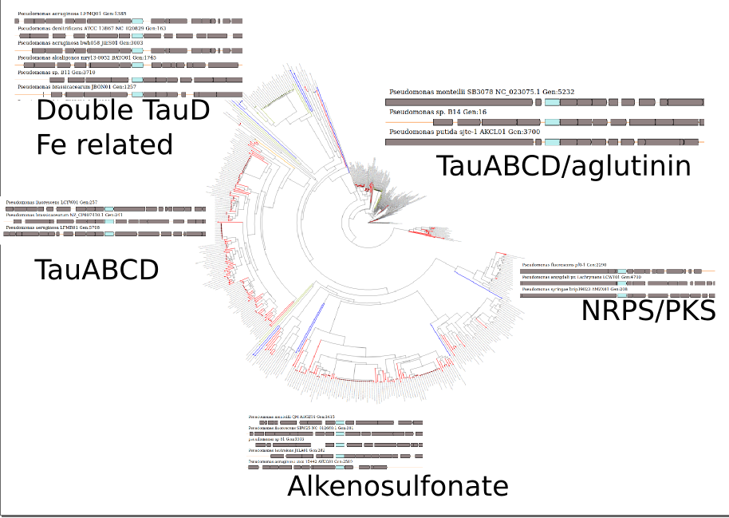

```{r setup, include=FALSE}
library(knitr)
knitr::opts_chunk$set(echo = TRUE)
```
[@cibrian-jaramillo_increasing_2016] m [@medema_computational_2015,@blin_recent_nodate]
EvoMining is a visual, evolutionary based genome mining tool with the milestone of prioritize non standard secondary metabolite pathways. The algorithm follows enzyme families from central pathways on their recruitment as components of natural products biosynthetic gene clusters (BGCs). The assumption behind EvoMining is that on prokaryotic genomes enzyme families are expanded frequently either by duplication or by horizontal gene transfer and that this expansions are acting as evolutionary raw material being recruited into secondary metabolism to perform nobel chemical functionalities. A proof of concept of EvoMining idea was provided by the discovery of an arseno compound on Streptomyces coelicolor [@cruz-morales_phylogenomic_2016], nevertheless. Despite EvoMining analysis has recently being present on the natural products field [@blin_recent_nodate,@alanjary_antibiotic_2017,@ziemert_evolution_2016,@miller_interpreting_2017] EvoMining software has not been released, on this work we free EvoMining as a downloadable stand alone tool implemented on a docker container. EvoMining is free and open to all users and there is no login requirement.  

EvoMining inputs are a  (1) a custom genomic database (genomic-DB), (2) a central pathways database (central-DB) and (3) a natural product database (natural-DB) composed of genes that belongs to experimentally tested BGCs. 
 These three databases are provided and can be modified replaced and expanded by the user . The genomic-DB is a collection of up to date genomes in RAST format from taxonomically related organisms, including Actinobacteria, Cyanobacteria and Archaea. Selection of this taxa obeys to the possibility of comparing well known NPs producing organisms such as Actinobacteria and Cyanobacteria in contrast with Archaea that has been poorly investigated. The central-DB contains nine central pathways from Actinobacteria previously curated [@barona-gomez_what_2012], plus an update of seed metabolic enzymes identified after manual curation congruent with the central EvoMining paradigm.  The natural-DB currently comprises all sequences that belongs to some BGCs from The Minimum Information about a Biosynthetic Gene cluster (MIBiG) [@medema_minimum_2015].   

As output EvoMining identifies on the genomic-DB those expanded families from the central-DB that has at least a recruited member onto the natural-DB, proceeding then to the reconstruction of the evolutionary history of the enzyme family. Given an enzyme from the central-DB, the product of EvoMining analysis is a color coded tree of the expanded enzyme family that provides information about the metabolic fate. Specifically, enzymes from central metabolism are differentiated from known Natural Products enzymes and those expansions with potential activity into secondary metabolism are emphasised as putative novel recruitments. Further analysis of these hits allows visualization of the genomic vicinity guiding to the discovery of novel BGCs. In addition to the updates associated to the workflow of EvoMining, the version to be released will include the possibility of defining the dynamics of the gene content of any given BGC to explore the chemical plasticity related to EvoMining hits. This allows to prioritize which clusters possess more metabolite variations, therefore unmasking biosynthetic darkmatter (Medema and Fischbach 2015, Blin et al. 2017). 
EvoMining code and components (blast, muscle, FastTree, newick utilities, Gblocks,apache and SVG perl module) are wrapped on the docker container nselem/newevomining downloadable at the Docker hub. Code is available at github: https://github.com/nselem/EvoMining/ and manual at https://github.com/nselem/EvoMining/wiki. EvoMining tool will allow researchers to examine their own (meta)genomes and their own enzyme families in the search of expansions involved on novel secondary metabolism.

  
EvoMining will identify those expanded families of the central-DB within the genomic-DB that has at least a recruited member onto the natural-DB, proceeding then to the reconstruction of the evolutionary history of the enzyme family. Given an enzyme from the central-DB, the product of EvoMining analysis is an interactive color coded tree of the enzyme expanded family where best bidirectional hits (BBH) of central-DB are differentiated from Natural Products members and those expansions close to a Natural Product sequence that are not BBH with central-DB enzymes are emphasised as putative nobel recruitments into secondary metabolism.  


Here we present the EvoMining expansions analysis using different genome-DB such as Actinobacteria, Cyanobacteria, Pseudomonas and Archaea. To present complementation possibilities of central DB an example of what we called backward EvoMining was incorporated: BGCs from S coelicolor available at Mi-BIG were analyzed EvoMining backwards and all enzyme families expanded but not over represented were followed. Finally to prioritize which clusters possess more metabolite variations, assuming a link between genomic and metabolite plasticity we apply the idea of classifying the saturation of a pangenome as open/closed pangenome measuring BGCs as open / closed BGC.  

EvoMining code and components (blast, muscle, FastTree, newick utilities, Gblocks,apache and SVG perl module) are wrapped on the docker container  nselem/newevomining downloadable at the Docker hub. Code is available at at github: nselem/EvoMining and manual at https://github.com/nselem/EvoMining/wiki. EvoMining tool will allow researchers to examine their own genomes and their own enzyme families in the search of expansions involved on nobel secondary metabolism.  
  [@dufresne_algorithmique_2016,@blin_recent_nodate,@kurtboke_revisiting_2017,@miller_interpreting_2017,@schniete_expanding_2017,@kim_recent_2017,@robertsen_toward_2017,@juarez-vazquez_evolution_nodate,@chavali_bioinformatics_nodate,@tracanna_mining_2017,@ren_breaking_2017,@choudhary_current_2017,@alanjary_antibiotic_2017,@chevrette_sandpuma:_2017,@wohlleben_antibiotic_2016,@weber_secondary_2016]
## Manual pages 
github  

  
## Figure 1  EvoMining pipe-line   


## Figure 2  Expansions on some databases TauD on Pseudomonas.    
EvoMining customizable databases

Central database TauD from Pseudomonas 217 Pseudomonas

Genomic Database
Archaea Cyanobacteria, PSeudomonas and Actinobacteria based on central metabolism from actinobacteria  
Archaea is an unexplored phylum.


To acotate the search for enzymes of recent recruitment into natural products  

## Figure  3.1  Expansions on genomic dinamics  and Backward EvoMining
Heat MAP HERE 
Beyond the obvious central metabolism enzymes, is it posible that exists some enzymes shared by Actniobacteria but maybe not on the core enzymes and with recentr recruitments into BGCs. Streptomyces coelicolor for example contain XXXX genes on its genomes, wich one could be relevant on the recruitment analysis. Backward evoMining means take those enzymes from BGCs in secondary metabolism and look for their correspondent homolgs in other contexts. The ideas of genomic dinamics and backward EvoMining, were test by taking the 16 cluster from Streptomyces Coelicolor analizing the expansions of all enzymes reported on MiBig. Tehre are XX of the that seems to be exclusive of the cluster. Other are two srpead and finally there are somethngn in betwwen.  

```{r CoelicolorMiBig, results = "asis"}
table <- read.csv("Figura3MiBIG/CoelicolorMiBIG", row.names = 1,sep="\t")
kable(table,  caption = "Coelicolor\\label{tab:Coelicolor MiBig}",caption.short = "CoelicolorMiBig ")
```


```{r}
tableExp <- read.csv("Figura3MiBIG/ExpansionBlast.data", row.names = 1,sep="\t")
kable(tableExp,  caption = "CoelicolorExpansions\\label{tab:Coelicolor Expansions}",caption.short = "CoelicolorExpansions")
```

Presence Absence
EvoMining was run over enzymes with expansion number between .1 and .6


## Figure 4  Pan cluster Idea on closed Streptomyces  
Open /closed coelicolor How spread is the cluster 

  
Took 15 clusters from Streptomyces coelicolor on MiBig Analize its open/close pancluster according to EvoMining backwards  
O sea 15 corasones, no, necesito escoger las query enzyme, al menos 3 por cluster... y que no sean NRPS o PKS

Last Idea Taud On Pseudomonas And an Experiment  

```{r bib, child = 'bibliography.Rmd'}
```