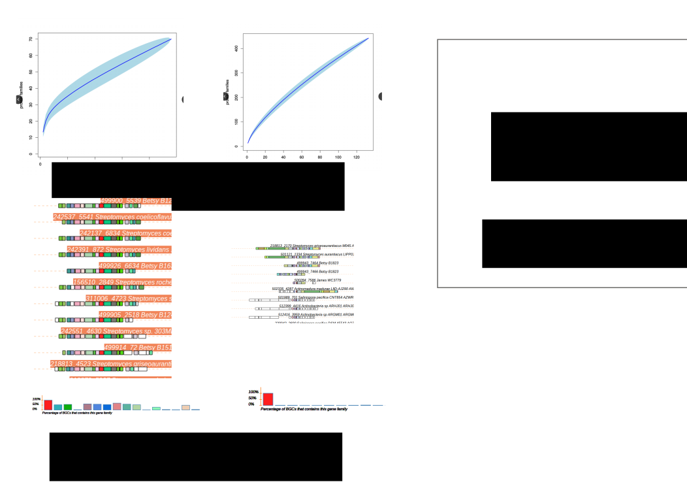

```{r setup, include=FALSE}
library(knitr)
knitr::opts_chunk$set(echo = TRUE)
```

```{r loading_tables_Actino,message=FALSE,echo=FALSE}
library(ggplot2)
library( reshape )
library(plyr ) 
library(RColorBrewer)
library(scales)
library(RColorBrewer)
hm.palette <- colorRampPalette(rev(brewer.pal(11, 'Spectral')), space='Lab')  
```

<!--codigo de evoMining display column even if only ceros, se despliega si le bajas el score a cero, pero quiero que se despliegue siempre-->
<!-- Plan
Figura 1 Figuras/EvoMiningPipeline.svg 
Figura 2 Figuras/TauDpseudomonas2.svg 
Figura 3 Figuras/GenomicDBS.svg Semana 2
Figura 4 Figuras/Backward.svg   Semana 1 
Figura 5 Figuras/PanCluster.svg  Semana 3
-->

## EvoMining 2.0: A customizable computational pipeline for evolutionary reconstructions during genome mining  
Selem-Mojica Nelly, Cruz-Morales Pablo, Martínez-Guerrero Christian , ...,  and Barona-Gómez Francisco   							  
  
## Abstract  
<!-- Por qué son importantes los productos naturales  
Por qué es importante el genome mining en esta investigación  
Cómo se ha resuelto el problema hasta ahora  
Que aporta EvoMining  
Qué se hace en este estudio  
Cuáles son las perspectivas  -->
Microbial natural products has importance in human health and life. Due to the abundance of genomic and metagenomic data, new natural products research by genome mining is a growing field. Traditional genome mining  approaches explored bacterial genomes localizing marks of previously knwon secondary metabolism enzymes organized on biosynthetic gene clusters (BGCs). Here we present EvoMining a downloadable visual genome mining tool that incorporates evolution theory into genome mining. On EvoMining databases are customizable, its based on enzyme expansions not on BGCs. The advantage of this method is that every expanded enzyme family is a candidate to explore recruitments, and all prokatyiotic genome, even the unexplored Archaea kingdom. On this study EvoMining was applied to several database such as Cyanobacteria, Actinobacteria, Pseudomonas and Archea studying expansions for enzyme families such as TauD and other enzymes recently recruited onto secondary metabolism. Finally the genomic plasticity of Streptomyces coelicolor known BGCs i explored generlizind applying the open/Close pangenome approach to a BGCs. This Evolutionary methods open the door to discover not previously knwon chemical compounds at private genome collections and prioritize them according to their genomic plasticity.    
  
## Introduction  
<!--
- Productos Naturales  
- BGCs enzymas en los BGCs  
- software de priorizacion.  
- Bases de datos centrales en los que se ha explorado  Backward TauD,
- Bases de datos genómicas  TauD en Pseudomonas, Genomica de Archaea Cyanobacteria  
- Apertura y plasticidad de un genoma  
- Repetibilidad  y personalización permiten exploración.  
-->

Natural products are synthesized by biosynthetical gene clusters (BGCs) codified on the genome of a wide range of microorganisms. Enzymes that belong to a BGC can either be mainly restricted to secondary metabolism, or be a recent recruitment acting as accesory enzymes.  
With the genomic era and 500,000 prokaryotic genomes available at NCBI, there has been a oom of development of specilized genome mining software. Traditional approaches are based on recognize marks of enzymes devoted to secondary metabolism [@antismash], or domains [@clusterfinder] lattely Evolution [@arts nadine].   
On prokaryotic genomes enzyme families are expanded frequently either by duplication or by horizontal gene transfer and that this expansions are acting as evolutionary raw material being recruited into secondary metabolism to perform nobel chemical functionalities. A proof of concept of EvoMining idea was provided by the discovery of an arseno compound on Streptomyces coelicolor [@cruz-morales_phylogenomic_2016], nevertheless. 

Despite EvoMining analysis has recently being present on the natural products field [@blin_recent_nodate,@alanjary_antibiotic_2017,@ziemert_evolution_2016,@miller_interpreting_2017] EvoMining software has not been released, on this work we free EvoMining as a downloadable stand alone tool implemented on a docker container. EvoMining is free and open to all users and there is no login requirement. 
Despite Actinobacteria are great natural product producers [@omura] other microrganisms can be explored.  

Here we present the EvoMining expansions analysis using different genome-DB such as Actinobacteria, Cyanobacteria, Pseudomonas and Archaea. To enrich possibilities of central DB an example of what we called backward EvoMining was incorporated: BGCs from S coelicolor available at Mi-BIG were analyzed EvoMining backwards and all enzyme families expanded but not over represented were followed. 

Finally to prioritize which clusters possess more metabolite variations, assuming a link between genomic and metabolite plasticity we introduce the idea of classifying the saturation of a pangenome as open/closed pangenome measuring BGCs as open / closed BGC.    

##  Results and Discussion   

### Figure 1  EvoMining pipe-line   
 EvoMining is a visual, evolutionary based genome mining tool with the milestone of prioritize non standard secondary metabolite pathways. The algorithm follows enzyme families from central pathways on their recruitment as components of natural products biosynthetic gene clusters (BGCs) within a genomic database. 
  
Figure1  
  
  
EvoMining inputs are a (1) a custom genomic database (genomic-DB), (2) a central pathways database (central-DB) and (3) a natural product database (natural-DB) composed of genes that belongs to experimentally tested BGCs. 
 These three databases are provided and can be modified, replaced and expanded by the user. In this work genomic-DB are  collection of up to date genomes in RAST format from taxonomically related organisms such as Actinobacteria, Cyanobacteria, Pseudomonas and Archaea. Selection of this taxa obeys to the possibility of comparing well known NPs producing organisms such as Actinobacteria and Cyanobacteria in contrast with Archaea that has been poorly investigated. The central-DB contains nine central pathways from Actinobacteria previously curated [@barona-gomez_what_2012], plus an update of seed metabolic enzymes identified after manual curation congruent with the central EvoMining paradigm.  The natural-DB currently comprises all sequences that belongs to some BGCs from The Minimum Information about a Biosynthetic Gene cluster (MIBiG) [@medema_minimum_2015].   

As output EvoMining identifies on the genomic-DB those expanded families from the central-DB that has at least a recruited member onto the natural-DB, proceeding then to the reconstruction of the evolutionary history of the enzyme family. Given an enzyme from the central-DB, the product of EvoMining analysis is a color coded tree of the expanded enzyme family that provides information about the metabolic fate. Specifically, enzymes from central metabolism are differentiated from known Natural Products enzymes and those expansions with potential activity into secondary metabolism are emphasised as putative novel recruitments. Further analysis of these hits allows visualization of the genomic vicinity guiding to the discovery of novel BGCs. In addition to the updates associated to the workflow of EvoMining, the version to be released will include the possibility of defining the dynamics of the gene content of any given BGC to explore the chemical plasticity related to EvoMining hits. This allows to prioritize which clusters possess more metabolite variations, therefore unmasking biosynthetic darkmatter (Medema and Fischbach 2015, Blin et al. 2017). 

EvoMining code and components (blast, muscle, FastTree, newick utilities, Gblocks,apache and SVG perl module) are wrapped on the docker container  nselem/newevomining downloadable at the Docker hub. Code is available at at github: nselem/EvoMining and manual at https://github.com/nselem/EvoMining/wiki. EvoMining tool will allow researchers to examine their own genomes and their own enzyme families in the search of expansions involved on nobel secondary metabolism.  

EvoMining will identify those expanded families of the central-DB within the genomic-DB that has at least a recruited member onto the natural-DB, proceeding then to the reconstruction of the evolutionary history of the enzyme family. Given an enzyme from the central-DB, the product of EvoMining analysis is an interactive color coded tree of the enzyme expanded family where best bidirectional hits (BBH) of central-DB are differentiated from Natural Products members and those expansions close to a Natural Product sequence that are not BBH with central-DB enzymes are emphasised as putative nobel recruitments into secondary metabolism.   

### Figure 2  Expansions on some databases   

Archaea Cyanobacteria, and Actinobacteria based on central metabolism from actinobacteria  
2.1 Expansions same central  
Expansions other central  
To acotate the search for enzymes of recent recruitment into natural products
    


### Figure  3.1  Expansions on genomic dinamics  
        3.2(Bakward EvoMining)    
        Coelicolor clusters  
Esto se hará solo sobre Streptomyces de los 1246  

```{r CoelicolorMiBig, results = "asis"}
table <- read.csv("Figuras/CoelicolorMiBIG", row.names = 1,sep="\t")
kable(table,  caption = "Coelicolor\\label{tab:Coelicolor MiBig}",caption.short = "CoelicolorMiBig ")
```
     

```{r}
# Expansions of enzime sequences from MiBIG from S coelicolor will be explored within the scope of the genomic database Streptomyces. The goal is to recover those enzymes that are not yet been considered as common on secondary metabolism. 
## Moda is the most common copy number on an organism, Organisms with an extra copy are the ones that may have this copy recrutied into secondary metabolism
# This extra copy on at least 4 organismos
## In addtiion the distribution of the enzyme is deseried present on at least half o the organisms (Not to exclusive)
## Too exclusive means only belong to secondary metabolism, we are looking for switches  
## looking for an esay number between 0 and one that reflects too expanded, too exclusive
#  y el exp number,  mas entre .2<= Exp <=.6 y analizar eso árboles.  
# One minus average organisms that contains one copy.
# More copies than organisms this number tends to one   ## too expanded
# few copies  on homogeneously on few organisms tends to cero ## too particular  
# two copies by organism .5  , that is not usually the case  because there is some variance 


#### Functions   
OneOrMode <- function(x){ #max between 0 and one
a = table(x) # x is a vector
moda=a[which.max(a)]
inte=max(1,as.integer(names(moda)))
return(inte)
}

Mode <- function(x){ ## mode
a = table(x) # x is a vector
moda=a[which.max(a)]
inte=as.integer(names(moda))
return(inte)
}


OrganismsExtraCopy <- function(x){ ##how many organisms has an extra copy than the mode
  a = table(x) # x is a vector  
  moda=a[which.max(a)]
  inte=as.integer(names(moda)) #the moda
  subx<-as.integer(a[which(as.integer(names(a))>inte)]) ## vector of organisms with extra copies
  suma<-sum(subx) ## how many
return(suma)
}

OrgAtLeastOneCopy <- function(x){ ##how many organisms has an extra copy than the mode
  a = table(x) # x is a vector  
  subx<-as.integer(a[which(as.integer(names(a))>0)]) ## vector of organisms with extra copies
  suma<-sum(subx) ## how many
return(suma)
}


Copies <- function(x){ ##how many organisms has an extra copy than the mode
  suma<-sum(x) ## how many
return(suma)
}

######## Reading and sorting data   
## Read EvoMining tables
tableExp <- read.csv("Figuras/ExpansionBlast.data", header=TRUE, sep="\t")  
tableCentral <- read.csv("Figuras/Central.data", header=TRUE, sep="\t")  

tableDistribution <- read.csv("Figuras/Enzymes.Distribution", header=TRUE, row.names=1,sep="\t")  
tableCentralDistribution <- read.csv("Figuras/CentralEnymes.Distribution.csv", header=TRUE, row.names=1,sep="\t")  

#necesito poner el valor de names de moda en el renglon con el mismo valor en enzima
#number of organisms greater than mode  at least tenpercent of the genome
##Reducing tableExp to those I have distribution
tableExp=tableExp[tableExp$Enzyme %in% names(tableDistribution),]
tableExp <- tableExp[order(tableExp$Enzyme),] 
tableDistribution <- tableDistribution[,order(names(tableDistribution))] 


################# Extra copy present at least in three organism
tableDistribution$Enzyme_151
sum(tableDistribution$Enzyme_151)


modaOrOne=apply(tableDistribution,2, OneOrMode)
CentralmodaOrOne=apply(tableCentralDistribution,2, OneOrMode)
modaOrOne

moda=apply(tableDistribution,2, Mode)
Centralmoda=apply(tableCentralDistribution,2, Mode)

moda

ExtraCopy=apply(tableDistribution,2, OrganismsExtraCopy)
CentralExtraCopy=apply(tableCentralDistribution,2, OrganismsExtraCopy)
ExtraCopy

OneCopy=apply(tableDistribution,2, OrgAtLeastOneCopy)
CentralOneCopy=apply(tableCentralDistribution,2, OrgAtLeastOneCopy)
OneCopy

CopiesEvo=apply(tableDistribution,2, Copies)
CentralCopiesEvo=apply(tableCentralDistribution,2, Copies)
#CopiesEvo

Average=colMeans(tableDistribution)
CentralAverage=colMeans(tableCentralDistribution)
Average
CopiesEvo

#names(moda)
tableExp$Moda=moda
tableExp$Average=Average
tableExp$ExtraCopy=ExtraCopy
tableExp$OneCopy=OneCopy
tableExp$CopiesEvo=CopiesEvo

tableCentral$Moda=Centralmoda
tableCentral$Average=CentralAverage
tableCentral$ExtraCopy=CentralExtraCopy
tableCentral$OneCopy=CentralOneCopy
tableCentral$CopiesEvo=CentralCopiesEvo


#One minus average organisms that contains one copy.
#More copies than organisms this number tends to one   ## too expanded
# few copies  on homogeneously on few organisms tends to cero ## too particular  
# two copies by organism   .5  , that is not usually the case  because there is some variance 
tableExp$ExpNum=(modaOrOne-tableExp$OneCopy/tableExp$CopiesEvo)/(modaOrOne)  
tableCentral$ExpNum=(CentralmodaOrOne-tableCentral$OneCopy/tableCentral$CopiesEvo)/(CentralmodaOrOne)  
#tableExp$ExpNum
#tableExp$Enzyme <- factor(tableExp$Enzyme, levels = tableExp$Enzime[order(tableExp$Order)])
 tableExp$Enzyme<-with(tableExp,reorder(tableExp$Enzyme, tableExp$Order))
str(tableExp)
#tableExp$ExpNum <- factor(tableExp$ExpNum, levels = tableExp$ExpNum[order(tableExp$Order)])
#tableExp$Moda<- factor(tableExp$Moda, levels = tableExp$Moda[order(tableExp$Order)])
#tableExp$Average<- factor(tableExp$Average, levels = tableExp$Average[order(tableExp$Order)])
#tableExp$ExtraCopy<- factor(tableExp$ExtraCopy, levels = tableExp$ExtraCopy[order(tableExp$Order)])
#tableExp$OneCopy<- factor(tableExp$OneCopy, levels = tableExp$OneCopy[order(tableExp$Order)])
#tableExp$CopiesEvo<- factor(tableExp$CopiesEvo, levels = tableExp$CopiesEvo[order(tableExp$Order)])

##tableExp <- factor(tableExp, levels = tableExp[order(tableExp$Order)])
tableExp$Enzyme

#str(tableExp)
#tableExp2 <- tableExp[order(tableExp$Order),] 

require("svglite")


#save the plot in a variable image to be able to export to svg
    image=ggplot(tableExp,aes(x=tableExp$Order, y=tableExp$ExpNum, color=tableExp$BGC, size = tableExp$Moda))+ geom_point() + labs(x = "Metabolic Families", y = "Exp Number Actinobacteria Genomes",text = element_text(size=12)) + theme_bw()+theme(plot.title = element_text(size = 20, face = "bold"), text = element_text(size = 14), axis.title = element_text(face="bold"), axis.text.x=element_text(angle = 90,size = 16), legend.position = "bottom")
    
    ggplot(tableExp,aes(x=tableExp$Order, y=tableExp$ExpNum, color=tableExp$BGC, size = tableExp$Moda))+ geom_point() + labs(x = "Metabolic Families", y = "Exp Number Actinobacteria Genomes",text = element_text(size=12)) + theme_bw()+theme(plot.title = element_text(size = 20, face = "bold"), text = element_text(size = 14), axis.title = element_text(face="bold"), axis.text.x=element_text(angle = 90,size = 16), legend.position = "right")
    
    ggsave(file="test.svg", plot=image, width=20, height=8)

    
tableEnzymeReduced=subset(tableExp,tableExp$ExpNum<=.6 & tableExp$ExpNum>= .2 )
    ggplot(tableEnzymeReduced,aes(x=tableEnzymeReduced$Order, y=tableEnzymeReduced$ExpNum, color=tableEnzymeReduced$BGC, size = tableEnzymeReduced$Moda))+ geom_point() + labs(x = "Metabolic Families", y = "Exp Number Actinobacteria Genomes",text = element_text(size=12)) + theme_bw()+theme(plot.title = element_text(size = 20, face = "bold"), text = element_text(size = 14), axis.title = element_text(face="bold"), axis.text.x=element_text(angle = 90,size = 16), legend.position = "right")

#kable(tableExp,  caption = "CoelicolorExpansions\\label{tab:Coelicolor Expansions}",caption.short = "CoelicolorExpansions")
```

Presence Absence
EvoMining was run over enzymes with expansion number between .1 and .6
Figuras/GenomicDBS.svg
### Figure 4  Pan cluster Idea on closed Streptomyces  



Open /closed coelicolor How spread is the cluster
  How to describe the cluster  
  Conservation  
  Enzymes that appear x% 
  
  Variability   How variable is the region  
  derivative of rarefaction curve   
  
  
Took 15 clusters from Streptomyces coelicolor on MiBig Analize its open/close pancluster according to EvoMining backwards  
O sea 15 corasones, no necesito escoger las query enzyme, al menos 3 por cluster... y que no sean NRPS o PKS
  
## MEthodology
    [@dufresne_algorithmique_2016,@blin_recent_nodate,@kurtboke_revisiting_2017,@miller_interpreting_2017,@schniete_expanding_2017,@kim_recent_2017,@robertsen_toward_2017,@juarez-vazquez_evolution_nodate,@chavali_bioinformatics_nodate,@tracanna_mining_2017,@ren_breaking_2017,@choudhary_current_2017,@alanjary_antibiotic_2017,@chevrette_sandpuma:_2017,@wohlleben_antibiotic_2016,@weber_secondary_2016]

```{r bib, child = 'bibliography.Rmd'}
```
  