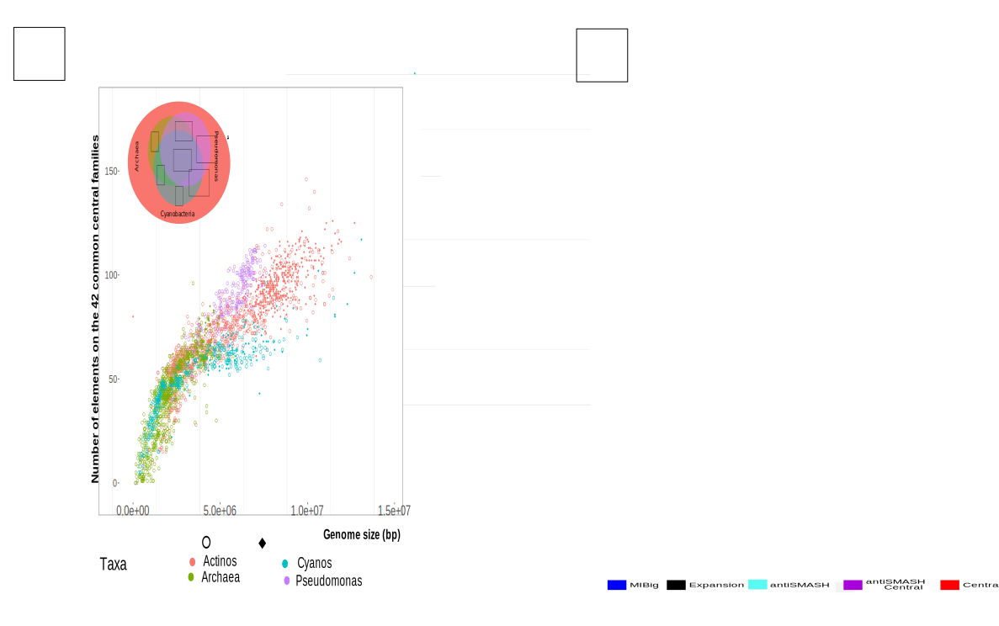
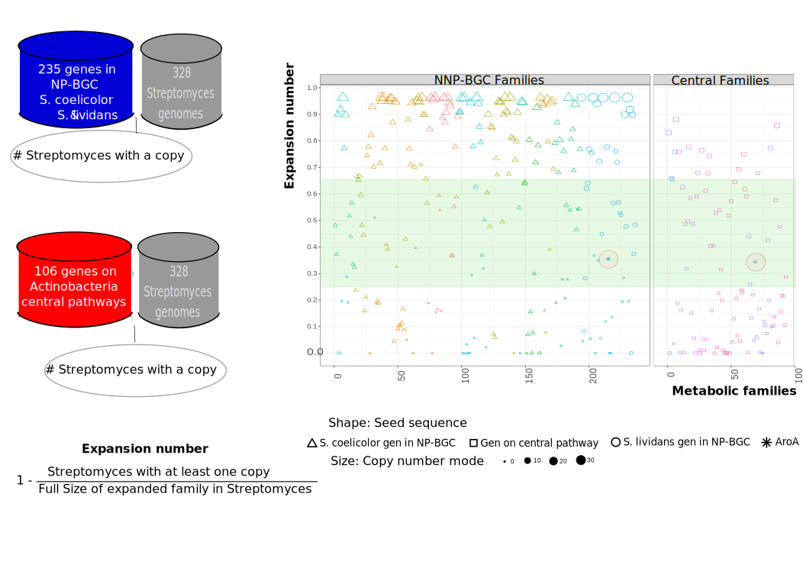

```{r setup, include=FALSE}
library(knitr)
knitr::opts_chunk$set(echo = TRUE)
```

```{r loading_tables_Actino,message=FALSE,echo=FALSE}
library(ggplot2)
library( reshape )
library(plyr ) 
library(RColorBrewer)
library(scales)
library(dplyr)
if(!require(devtools))
  install.packages("devtools", repos = "http://cran.rstudio.com")
if(!require(easyGgplot2))
  install_github("kassambara/easyGgplot2")
library(easyGgplot2)

hm.palette <- colorRampPalette(rev(brewer.pal(11, 'Spectral')), space='Lab')  
tropical=c('darkorange','dodgerblue','hotpink')
palette(tropical)


```

<!--codigo de evoMining display column even if only ceros, se despliega si le bajas el score a cero, pero quiero que se despliegue siempre-->
<!-- Plan
Figura 1 Figuras/EvoMiningPipeline.svg Metabolismo expansion
Figura 2 Figuras/GenomicDBS.svg Semana 2 Base genomica ->PriA
Figura 3 Figuras/TauDpseudomonas2.svg Base central -> TauD
Figura 4 Figuras/Backward.svg   Semana 1 AntiSMASH  
Figura 5 Figuras/PanCluster.svg  Semana 3  Poner los clusters de la nueva Familia  
-->
<!--!
## old 
  starts with a blast search with query the CentralDB against the genomic DB,  comprises a docker  
by 25 private Actinobacteria genomes and 1221 public Actinobacterial genomes with at least 3 genes by contig on average available at NCBI on 2016
this requirement provides functional annotation when looking for the genomic context of a particular enzyme.--->


Nelly Sélem-Mojica$^1$, Christian Martínez-Guerrero$^{1,2}$, César Aguilar$^1$, and Francisco Barona-Gómez$^1$		 
  
$^1$ Evolution of Metabolic Diversity Laboratory, Unidad de Genómica Avanzada (Langebio), Cinvestav-IPN, Irapuato, México.  
$^2$ Mitocondrial DNA and paleogenomics Laboratory, Unidad de Genómica Avanzada (Langebio), Cinvestav-IPN, Irapuato, México.  
  
*Corresponding author  
Email: francisco.barona@cinvestav.mx  +52 473 652 02 46  
  
**Keywords:** Genome mining, evolution, secondary metabolism, pipeline.    
  
**Subject category:** Genomics and systems biology  
  
**Word Count:** 5000  
  
**Depositories:**   
Zenodo  
React  
**Abbreviations:**  
**GDH** Glutamate dehydrogenase  
**ASL** Acetolactate synthase large subunit  
  
    
      
      
\clearpage  

## Abstract  
Genome mining has become a growing field due to abundance of genomic data and the importance of microbial natural products in human health and life. Traditional genome mining approaches explore bacterial genomes by identifying canonical domains of previously known secondary metabolism genes organized in biosynthetic gene clusters. Here we present EvoMining a downloadable visual genome mining tool that incorporates evolutionary theory into genome mining. EvoMining databases are customizable, its based on enzyme expansions not on BGCs. The advantage of this method is that every expanded enzyme family is candidate to explore recruitments, and all prokaryotic genome, even the unexplored Archaea kingdom. In this study EvoMining was applied to several databases such as Actinobacteria, Cyanobacteria, Pseudomonas and Archaea studying expansions for core enzyme families and including shell enzyme families such as TauD.  Glutamate dehydrogenase and acetolactate synthase are other enzymes recently recruited onto secondary metabolism. This evolutionary methods open the door to discover not previously known chemical compounds at private genome collections.
  
\clearpage 

## Introduction  
Natural products are synthesized by biosynthetic gene clusters (NP-BGCs) distributed in the genome of a wide range of microorganisms. More than a thousand NP-BGCs are available at the community-driven repository called The Minimum Information about a Biosynthetic Gene cluster (MIBiG) ^[@medema_minimum_2015]. With around 500,000 prokaryotic genomes available at public databases there has been a need for developing specialized genome mining approaches and related softwares. Traditional approaches are based in sequence similarity with enzymes devoted to secondary metabolism and their domains ([antiSMASH, cimermacic, clustrerFinder). previous biosynthetic knowledge. Recently, evolutionary process have been also exploited to mine genomes for novel BGCs (Cruz-Morales 2012, 2016, nadine). In these latter approaches, enzymes that belong to a BGC can either be mainly restricted to secondary metabolism, or be a recent recruitment acting as accessory enzymes, a concept has been further exploited in the context of antibiotic resistance (ARTS) .   
  
Gene duplication and horizontal gene transfer constantly expand enzyme families. Extra copies in expanded families are recruited into secondary metabolism BGCs to perform novel chemical functionalities [REF scytonemin, moore]. EvoMining captures evolutive histories of enzyme families expansion and recruitment events. First, given an enzyme database (enzyme-DB), the algorithm identifies those expanded families in a given lineage (genomic-DB) that has at least a member in a natural products database. proceeding then to the reconstruction of the evolutionary history of the enzyme family. During this process enzymes from conserved metabolism (best bidirectional hits of enzyme database) are differentiated from expansions closest to the natural products database, i.e. putative novel recruitments into secondary metabolism. Further analysis of these hits includes visualization of the genomic vicinity guiding to the discovery of novel BGCs and allowing to prioritize biosynthetic darkmatter [Medema and Fischbach 2015, Blin et al. 2017].  
  
Nevertheless,  expansion and posterior recruitment is not an exclusive Actinobacteria feature, other microorganisms may also be explored evolutionary mined. Despite EvoMining analysis has recently being present on the natural products field (Blin et al. 2017,Alanjary et al. 2017,Ziemert, Alanjary, and Weber 2016, Miller, Chevrette, and Kwan 2017) EvoMining software has not been released.   
  
EvoMining is a visual genome mining tool with the milestone of prioritize non standard secondary metabolite pathways by considering evolutionary principles. Software containers are transforming the way scientist exchange software. Prior to containers software analysis were difficult to instal and hard to reproduce. A proof of concept of EvoMining principles was provided by the discovery of an arseno compound on Streptomyces coelicolor (Cruz-Morales et al. 2016) by apply EvoMining into a genomic database of 230 Actinobacteria  genomes.  
  
Building up from EvoMining 1.0, which was a consulting web server with fixed databases, here we report EvoMining 2.0, a stand alone downloadable tool wrapped in docker. Taking advantage of the new feature of customizable databases, both the genomic and enzyme databases were enriched and explore to bring about novel biological insights. A systematic analysis of expansion and recruitment events in different genome-DBs, including Actinobacteria, Cyanobacteria, Pseudomonas and Archaea, is performed, with the finding that predictions are taxa-dependent and enzyme family specific. We also expanded on the main concept behind EvoMining, first, by analyzing as proof-of-concept the EvoMining profile of enzymes known to be part of BGCs in the model strains S. coelicolor and S. lividans, and second, by expanding the enzyme universe and introducing enzymes that belong to the so-called ‘shell genome’. Overall, these analyses suggest that….  
  
## Methods  
  
Databases and input options  
To take advantage of functional annotation genome were processed by the Rapid Annotation using Subsystem Technology (RAST) platform [REF]. MIBiG repository is included in EvoMining docker image as default np-DB, metadata such as producer organism and kind of compound are also integrated to the np-DB. Sequences of the central-DB and np-DB must be on fasta format. To study the nature of expansions on other taxonomic groups beside Actinobacteria, three genomic databases were integrated by 1245 Actinobacteria, 416 Cyanobacteria, 876 Archaea, all genomes were annotated by RAST and mined by AntiSMASH stand alone docker parameters XXXXX. For this work Actinobacteria central-DB is composed by 295 Actinobacteria sequences of central enzymes organized in ninety-three families involved in nine pathways, including amino acid biosynthesis, glycolysis, pentose phosphate pathway, and tricarboxylic acids cycle. Seed sequences were taken mainly from 1) Streptomyces coelicolor A3, 2) Mycobacterium tuberculosis H37Rv and 3) Corynebacterium glutamicum. To integrate Cyanobacteria central-DB best bidirectional hits of Actinobacteria central-DB were selected among three organisms distributed on Cyanobacteria phylum 1) Cyanothece sp. ATCC 51142, 2) Synechococcus sp. PCC 7002 CP000951.1, 3) Synechocystis sp. PCC 6803 AP012205.1. Same procedure was taken to assemble Archaea central-DB, selecting organisms from diverse sections of Archaea kingdom, on this case 1) Natronomonas pharaonis, 2)Methanosarcina acetivorans, 3)Sulfolobus solfataricus and 4)Nanoarchaeum equitans Kin4-M. Expansions of enzyme families shared between this three taxonomic groups were calculated with EvoMining default parameters. Graphics for the data analysis on this work were generated by r, to guarantee reproducibility a rmarkdown document is available at: github/nselem/phd. Finally, EvoMining evolutionary analysis was conducted on PriA enzyme family on the three genomic database with default EvoMining parameters.  
To amplify the concept of central-DB to shell-DB allowing to explore expansions beyond just enzymes belonging to the core genome of a taxonomic group a shell enzyme was explored. As am example of shell sequence tauD was selected as seed of central-DB. Pseudomonas genome-DB was integrated as follows (). Genomes on genome-DB were RAST annotated and on this case no antiSMASH mining was conducted. EvoMining expansion-recruitment and phylogenetic analysis with default parameters was conducted for TauD enzyme family.  
All databases are downloadable at Zenodo (Doi numbers genomic-DB: STREPTOMYCES, Actinobacteria, Cyanobacteria, Pseudomonas, Archaea, central-DB: Actinobacteria, Cyanobacteria, Pseudomonas, Archaea, lividans/coelicolor BGC )
  
  
## Acknowledgments
Secretaria de Inovacion, Conabio:Keri/Ernesto, Argonne cluster Cocina Tepeyac

## Figures  and tables
  
Genomic DB  

Feature           EvoMining 1                   EvoMining 2                    Novel insights
--------------   ----------------------------   ------------------------      ------------------------  
Code                                                                  
                  Consulting web site           Standalone docker tool    
Databases      
                  Fixed                         Customizable                     
Genomic-DB     
                  Actinobacteria 230 genomes    Actinobacteria 1245 genomes   EvoMining predictions are lineage dependnet                    
                                                Cyanobacteria 416 genomes       
                                                Archaea 876 genomes  
Central-DB                                 
                  Actinobacteria 106 families   Actinobacteria 106 families                  
                                                Cyanobacteria  81 families      
                                                Archaea 80 families  
                                                RetroEvoMining XX num
Natural-DB                                                                                                    
                  Manual curation               MiBIG
                               
---------------  ----------------------------   -------------------   


```{r CoelicolorMiBig, warnings = FALSE, message = FALSE,echo=FALSE}
table <- read.csv("Figuras/CoelicolorMiBIG", row.names = 1,sep="\t")
kable(table,  caption = "Coelicolor\\label{tab:Coelicolor MiBig}",caption.short = "CoelicolorMiBig ")
```


```{r GenomicDatabase, eval=FALSE, message=FALSE, include=FALSE, results='hide', warnings=FALSE}
######################## Loading data  
#ArchaeasCentral <- read.table("../chapter3/ArchaeasCentral", header=TRUE, sep="\t")
#ArchaeasHeatPlot <- read.table("../chapter3/ArchaeasHeatPlot", header=TRUE, sep="\t")

PseudomonasCentral <- read.table("PSEUDOMONAS/Pseudomonas.Central", header=TRUE, sep="\t")
PseudomonasHeatPlot <- read.table("PSEUDOMONAS/HM_44_Pseudomonas", header=TRUE, sep="\t")
PseudomonasTaxa <- read.table("PSEUDOMONAS/Pseudomonas.taxa", header=TRUE, sep="\t")
PseudomonasTaxa$Kingdom<-"Pseudomonas"
PseudomonasTaxa$shape<-"Pseudomonas"
PseudomonasTaxa$shape[which(PseudomonasTaxa$Shape == "protegens")]<-"protegens"


ArchaeasCentral <- read.table("ARCHAEAS/Archaeas.Central", header=TRUE, sep="\t")
ArchaeasHeatPlot <- read.table("ARCHAEAS/HM_44_Archaea", header=TRUE, sep="\t")
ArchaeasNp <- read.table("../chapter3/ArchaeasNp", header=TRUE, sep="\t")
ArchaeasSMASH <- read.table("../chapter3/ArchaeasSMASH", header=TRUE, sep="\t")
ArchaeasTaxa <- read.table("ARCHAEAS/ArchaeasTaxa", header=TRUE, sep="\t")
ArchaeasTaxa$shape<-"Archaea"
ArchaeasTaxa$Kingdom<-"Archaea"
ArchaeasSMASH$Kingdom<-"Archaea"
ArchaeasTaxa$shape[which(ArchaeasTaxa$Order == "Natrialbales")]<-"Natrialbales"

#ActinosCentral <- read.table("../chapter4/ActinoCentral", header=TRUE, sep="\t")
#ActinosHeatPlot <- read.table("../chapter4/ActinoHeatPlot", header=TRUE, sep="\t")
ActinosCentral <- read.table("ACTINOS/Actinos.Central", header=TRUE, sep="\t")
ActinosHeatPlot <- read.table("ACTINOS/HM_44_Actinos", header=TRUE, sep="\t")

ActinosNp <- read.table("../chapter4/ActinoNp", header=TRUE, sep="\t")
ActinosSMASH <- read.table("../chapter4/ActinosSMASH", header=TRUE, sep="\t")
ActinosTaxa <- read.table("ACTINOS/ActinoTaxa", header=TRUE, sep="\t")
ActinosTaxa$Kingdom<-"Actinos"
ActinosTaxa$shape<-"Actinos"
ActinosSMASH$Kingdom<-"Actinos"
ActinosTaxa$SuperPhylum<-"Actinos"

ActinosTaxa$shape<-"Actinos"
ActinosTaxa$shape[which(ActinosTaxa$Order == "Streptomycetales")]<-"Streptomycetales"
ActinosTaxa$shape

#CyanosCentral <- read.table("../chapter5/CyanosCentral", header=TRUE, sep="\t")
#CyanosHeatPlot <- read.table("../chapter5/CyanosHeatPlot", header=TRUE, sep="\t")
CyanosCentral <- read.table("CYANOS/Cyanos.Central", header=TRUE, sep="\t")
CyanosHeatPlot <- read.table("CYANOS/HM_44_Cyanos", header=TRUE, sep="\t")
CyanosNp <- read.table("../chapter5/CyanosNp", header=TRUE, sep="\t")
CyanosSMASH <- read.table("CYANOS/CyanosSMASH", header=TRUE, sep="\t")
CyanosTaxa <- read.table("CYANOS/CyanosTaxa", header=TRUE, sep="\t")
CyanosTaxa$Kingdom<-"Cyanos"
CyanosTaxa$shape<-"Cyanos"
CyanosSMASH$Kingdom<-"Cyanos"
CyanosTaxa$SuperPhylum<-"Cyanobacteria"
CyanosTaxa$shape[which(CyanosTaxa$Order == "Nostocales")]<-"Nostocales"
ActinosTaxa$shape
########################### End of loading data
str(ActinosTaxa) #1245
str(CyanosTaxa) #416
str(ArchaeasTaxa) #876
str(PseudomonasTaxa) #876

#################################################################
## Joining data frames heat plot and taxa
TodosTaxa<-rbind(ArchaeasTaxa,CyanosTaxa,ActinosTaxa,PseudomonasTaxa)

#names(ArchaeasHeatPlot)
#intersect(names(CyanosHeatPlot),names(ActinosHeatPlot))

#intersect(intersect(names(CyanosHeatPlot),names(ActinosHeatPlot)),names(ArchaeasHeatPlot))
ArHP<-ArchaeasHeatPlot[,intersect(names(PseudomonasHeatPlot),intersect(intersect(names(CyanosHeatPlot),names(ActinosHeatPlot)),names(ArchaeasHeatPlot)))]
CyHP<-CyanosHeatPlot[,intersect(names(PseudomonasHeatPlot),intersect(intersect(names(CyanosHeatPlot),names(ActinosHeatPlot)),names(ArchaeasHeatPlot)))]
AcHP<-ActinosHeatPlot[,intersect(names(PseudomonasHeatPlot),intersect(intersect(names(CyanosHeatPlot),names(ActinosHeatPlot)),names(ArchaeasHeatPlot)))]
PsHP<-PseudomonasHeatPlot[,intersect(names(PseudomonasHeatPlot),intersect(intersect(names(CyanosHeatPlot),names(ActinosHeatPlot)),names(ArchaeasHeatPlot)))]
TodosHP<-rbind(ArHP,CyHP,AcHP,PsHP)
TodosEXP_TAXA<-merge(TodosHP,TodosTaxa,by.x="RastId",by.y="RastId")

#str(TodosHP)
####  End of joining dataframes
##########################################################################################################
##########################################################################################################
##########################################################################################################
################# Graphs 
#########################################################################################################

#########################################################################################################
## 1) Genome Size vs central expansion by facets 
GenomeSizeVsCentralExpansion<-qplot(TodosEXP_TAXA$Size, TodosEXP_TAXA$TOTAL, data = TodosEXP_TAXA,colour=TodosEXP_TAXA$Kingdom,shape=TodosEXP_TAXA$shape)+theme_bw()+ theme(legend.position	="bottom",plot.title = element_text(size = 24, face = "bold"),text = element_text(size = 12),axis.title = element_text(face="bold"),axis.text.x=element_text(size = 20),axis.text.y=element_text(size = 16)) +labs(x = "Genome size (bp)",    y = "Total number of expansions from central families",colour="Order" )+ scale_shape_manual(values =  c(1,1,1,18,18,18,1,18))


qplot(TodosEXP_TAXA$Size, TodosEXP_TAXA$TOTAL, data = TodosEXP_TAXA,colour=TodosEXP_TAXA$Kingdom,shape=TodosEXP_TAXA$shape)+theme_bw()+ theme(legend.position	="bottom",plot.title = element_text(size = 24, face = "bold"),text = element_text(size = 12),axis.title = element_text(face="bold"),axis.text.x=element_text(size = 20),axis.text.y=element_text(size = 16)) +labs(x = "Genome size (bp)",    y = "Total number of expansions from central families",colour="Order" )+ scale_shape_manual(values = c(1,1,1,18,18,18,1,18))

#qplot(TodosEXP_TAXA$Size, TodosEXP_TAXA$TOTAL, data = TodosEXP_TAXA,colour=TodosEXP_TAXA$Kingdom)+facet_grid(TodosEXP_TAXA$Kingdom ~ .)+theme_bw()+ theme(legend.position	="bottom",plot.title = element_text(size = 24, face = "bold"),text = element_text(size = 12),axis.title = element_text(face="bold"),axis.text.x=element_text(size = 20),axis.text.y=element_text(size = 16)) +labs(x = "Genome size (bp)",    y = "Total number of expansions from central families",colour="Order" )+ scale_shape_manual(values = c(1,1,1,18,18,1,18,18))

ggsave(file="Figuras/GenomeSizeVsCentralExpansion.svg", plot=GenomeSizeVsCentralExpansion, width=10, height=10)
## End genome size vs central expansion  
##########################################################################################################


```

```{r other, eval=FALSE, include=FALSE}

#############################################################################################################################
## 2) Box plot Expansiones familia y point Genome 
TodosHP$RastId <- with(TodosHP, reorder(TodosHP$RastId, TodosHP$TOTAL))
TodosHP.m <- melt(TodosEXP_TAXA,id = c("RastId","Kingdom","Name","SuperPhylum","Phylum","Class","Order","Family","Contigs","Size","RastNo"))
TodosHP.m<-subset(TodosHP.m,variable!="TOTAL")
#CyanosHeatPlot$RastId <- with(CyanosHeatPlot, reorder(CyanosHeatPlot$RastId, CyanosHeatPlot$TOTAL))
#CyanosHeatPlot.m <- melt(CyanosHeatPlot)
#CyanosHeatPlot.m<-subset(CyanosHeatPlot.m,variable!="TOTAL")
##   Boxplot expansiones en familias en colores por reinos
BoxCentralFamilies<-ggplot(TodosHP.m, aes(x=TodosHP.m$variable, y=TodosHP.m$value,color=TodosHP.m$Kingdom)) +labs(x = "Metabolic Families", y = "Copy number on Genomes",text = element_text(size=12)) + geom_boxplot()+theme_bw()+theme(plot.title = element_text(size = 14, face = "bold"), text = element_text(size = 12), axis.title = element_text(face="bold"), axis.text.x=element_text(angle = 90,size = 10), legend.position = "bottom")
####ggsave(file="BoxCentralFamilies.svg", plot=BoxCentralFamilies, width=30, height=8)
############### End of boxplot   
##########################################################################################################


######## 3) NOT READY Diversity of antiSMASH detection on 3 genomic DBs
CyanosSMASH.m <- melt(CyanosSMASH,id = c("RastId","Kingdom"))  
CyanosSMASH.m<-CyanosSMASH.m[(CyanosSMASH.m$value!=0)&(CyanosSMASH.m$value!="Cyanos")&(CyanosSMASH.m$variable!="TOTAL"),]
ArchaeasSMASH.m <- melt(ArchaeasSMASH,id = c("RastId","Kingdom"))  
ArchaeasSMASH.m<-ArchaeasSMASH.m[(ArchaeasSMASH.m$value!=0)&(ArchaeasSMASH.m$value!="Archea")&(ArchaeasSMASH.m$variable!="TOTAL"),]
ActinosSMASH.m <- melt(ActinosSMASH,id = c("RastId","Kingdom"))  
ActinosSMASH.m<-ActinosSMASH.m[(ActinosSMASH.m$value!=0)&(ActinosSMASH.m$value!="Actinos")&(ActinosSMASH.m$variable!="TOTAL"),]
Todos_SMASH<-rbind(ActinosSMASH.m,CyanosSMASH.m,ArchaeasSMASH.m)
DiversitySMASH<-ggplot2.barplot(data=Todos_SMASH, xName="Kingdom",  groupName="variable",showLegend=FALSE)

####ggsave(file="DiversitySMASH.svg", plot=DiversitySMASH, width=30, height=8)

## HACEr una funcion con la diversidad de Archaea 
#lista<-list(CyanosSMASH,ArchaeasSMASH,ActinosSMASH)
#lista<-list(NonZeroCyanos,NonZeroArchaeas,NonZeroActinos)
#TODOS_SMASH<-bind_rows(lista)
#aver<-TODOS_SMASH[TODOS_SMASH$RastId=="389046",]$TOTAL
#aver
#2 Tener boxplot de expansiones por familia por kingdom LISTOOO
#3 Escoger una familia para analizar a detalle por genero y poner sus árboles  PriA por ejemplo  

## Good code but not in use  
#names(CyanosSMASH)
#intersect(names(CyanosSMASH),names(ArchaeasSMASH))
#nonzero <- function(x) sum(x != 0)
#NonZeroCyanos<-numcolwise(nonzero)(CyanosSMASH)
#NonZeroArchaeas<-numcolwise(nonzero)(ArchaeasSMASH)
#NonZeroActinos<-numcolwise(nonzero)(ActinosSMASH)
#union( union(names(CyanosSMASH),names(ArchaeasSMASH)),names(ActinosSMASH))
#union( union(names(NonZeroCyanos),names(NonZeroArchaeas)),names(NonZeroActinos))

################## Init Figura antiSMASH propuesta por Paco Simil paper EvoMining  
# Previous                            #     Current      
#Genomic DB 230 genomas               #     Genomic DB   1245 genomes
# Central 106 families                #     Central 93 families 
# 226 BGCs                            #     1296 BGCs with 44552 enzymes
# Previous results            ######################################
# 101 expandidas                      #     93 Expansions, O bien 80 si consideramos solo expansiones on at least 1% (12.45) of organisms # Expandidas en coelicolor 33
# 23 enzimas con reclutamientos       #      82 ?? Recruitments  11 non recruitments 76 according to dataframe. 

## plan para replicar la figura CONSULTAR CON PACO Qué familias   
## Hacer un script que obtenga los BBH de las central con cada familia expandida 
## De los que nos son BBH cuales son antiSMASH /Cluster Finder  
## Cuales son MIBIG  
## Cuales no son nada.  

## I´m starting with Actinobacteria  
## 1) Identifying Familis with expansions  
## ActinosHeatPlot Has the hits    
 ## Now need a function how many organisms has expansions and in total how many expansions are from the 95 families  
#compare two vectors if ai > bi then 1 
ActinosHP <-ActinosHeatPlot
str(ActinosHP)
rownames(ActinosHP) <- ActinosHeatPlot[,1]
  HeatAverage=colMeans(ActinosHP)
  HeatSD=apply(ActinosHP, 2, sd)
ExpTresHold<-HeatAverage+HeatSD

### Coelicolor expansions   
Coelicolor<-ActinosHP["242137",]
names(Coelicolor)
Coelicolor<-Coelicolor[!names(Coelicolor) %in% c("TOTAL","RastId")]
ExpTresHold2<-ExpTresHold[!names(ExpTresHold) %in% c("TOTAL","RastId")]
CoeliExpansions<-Coelicolor>ExpTresHold2
CoeliExpansionsTotal<-sum(CoeliExpansions) ## how many expansions
CoeliExpansionsTotal ## 34
CoeliExpansionsFamilies<-Coelicolor[CoeliExpansions]## which families are expanded   
CoeliExpansionsFamilies
CoeliExpansionsFamilies<-names(Coelicolor)[CoeliExpansions]## which families are expanded   
CoeliExpansionsFamilies
########### End coelicolor expansions 

############## starting families exapnsions 
ExpTresHold$RastId<-"Treshold"

ActinosHP<-rbind (ActinosHP, ExpTresHold)  

FamiliesExpanded <- function(x){ ## is a column
  ultimo<-tail(x, n=1)
  subx<-x>ultimo ## vector of organisms with extra copies
  suma<-sum(subx) ## how many
return(suma)
}

ExpandedFamilies=apply(ActinosHP,2, FamiliesExpanded)  
ExpandedFamilies<-ExpandedFamilies[!names(ExpandedFamilies) %in% c("TOTAL","RastId")]
str(ExpandedFamilies)
nonzero <- function(x) sum(x != 0)
zero <- function(x) sum(x == 0)
Atleast1Percent<- function(x) sum(x >12.45)  

NonZeroExpandedFamilies<-nonzero(ExpandedFamilies)
ZeroExpandedFamilies<-zero(ExpandedFamilies)
Percent1ExpandedFamilies<-Atleast1Percent(ExpandedFamilies)
ZeroExpandedFamilies
NonZeroExpandedFamilies
Percent1ExpandedFamilies

ExpandedFamilies["Phosphoglycerate_dehydrogenase"]
#qplot(1:length(ExpandedFamilies), ExpandedFamilies, xlab ="Families") + geom_line()
FiguraExpanded<-qplot(names(ExpandedFamilies), ExpandedFamilies, xlab ="Families") + geom_line()+theme(plot.title = element_text(size = 14, face = "bold"), text = element_text(size = 12), axis.title = element_text(face="bold"), axis.text.x=element_text(angle = 90,size = 10), legend.position = "bottom")

### Ahora quien de estas familias tienen reclutamientos   
## Quiero grafica familia vs #reclutamientos 
ActinosNpReduced<-subset(ActinosNp,ActinosNp$np!="none")
cdata <- ddply(ActinosNpReduced, "Central", summarise,Nps  = length(np))
rownames(cdata) <- cdata[,1]
names(ExpandedFamilies)
row.names(cdata)

## Eliminar los 11 nones
ExpandedAndRecruited<-intersect(names(ExpandedFamilies),row.names(cdata))
cdata2<-subset(cdata,row.names(cdata) %in% ExpandedAndRecruited)
ExpandedFamilies2<-ExpandedFamilies[names(ExpandedFamilies) %in% ExpandedAndRecruited]
cdata2<-cdata2[match(names(ExpandedFamilies2), cdata2$Central),]
cdata2$Expansions=ExpandedFamilies2  
cdata2.m<- melt(cdata2,id = c("Central"))

##### Solo me falta graficar  
figure<-ggplot(cdata2.m, aes(x = cdata2.m$Central, y = cdata2.m$value, fill = cdata2.m$variable))+ geom_bar(stat = "identity")+theme(plot.title = element_text(size = 14, face = "bold"), text = element_text(size = 12), axis.title = element_text(face="bold"), axis.text.x=element_text(angle = 90,size = 10), legend.position = "bottom")

### ggplot2.barplot(data=cdata2.m, xName="Central",  groupName="value")
#cdata
#summary(ActinosNp)
## Quito none, interseccion y stack bar

#qplot(x=Central, data=ActinosNp, geom="bar", fill=np, position="stack")+theme_bw()+ theme(legend.position	="none",text = element_text(size=8), axis.text.x = element_text(angle = 90, hjust = 1, vjust = 0.5) ,axis.text.y = element_text(angle = 0, hjust = 1, vjust = 0.5) )

```
<!-- this is the code for GenomicDiversity Figure-->
```{r Figure_Pablo2, eval=FALSE, message=FALSE, include=FALSE, results='hide', warnings=FALSE}
  
#  1) Every BBH: (BBH Totales) Directly from blast not all of this sequences will go to EvoMining heat plot due to EvoMining restriction
# cp BBH/*/aux_files/vuelta*.blast.bbh .
#  perl GetBBH.pl vuelta*.blast.bbh |sort
#  output *.bbh
#  on excell sort families alphabetically 
  
#  2) Family Number From evoMiningHeatmap  ##Fallo, cyanos heatplot revisar correctos
#  Crear archivo vi Central.numbers
#  ls *central|sort -g |while read line; do fam=$(head -n1 $line|cut -d'|' -f3|rev  | cut -d'_' -f2- | rev);num=$(echo $line|cut -d'.' -f1);echo -e $num'\t'$fam; done>Central.numbers
      
#  3) All sequences on tree but oranges (TOTALTree)  
#  ls *concat.fasta |sort -g|while read line; do num=$(grep '>' $line|sort|uniq|wc); echo $line $num; done|cut -d' ' -f1,2   
# concat contains cyan, black and red leaves but not the oranges  
  
#  4) candidates to BBH on tree first red colored  (FirstRED)
#  perl GetBBHonTree.pl Central.numbers  
#  output .bbh.tree  
  
#  5) AntiSMASH on sequences on tree  CYAN  
#   Ids antiSMASH file  
#   cp smash into evomining folder
#   cut -f2 *smash |sort > ._F1  
#   Ids list 
#   ls *concat.fasta|sort -g |while read line; do grep '>' $line|cut -d'|' -f2 |sort >$line.ids; done  
#   ls *ids |sort -g |while read line; do comm -12 Archeas_Smash_F1 $line>$line.smash; done  
#   output .smash
#   ls *smash|sort -g |while read line; do num=$(wc -l<$line);echo -e $num'\t'$line; done
   
   
#  6) AntiSMASH on BBH on tree (AntiSMASHonTree) CYAN_OVER_RED
#    perl GetBBHonTreeAndonSmash.pl Central.numbers  
#    Output .bbh_smash

#  7) Blue MiBig BLUE
# seq 44|while read line; do if [ -f $line.fasta_ExpandedVsNp.blast.2.recruitedUniq ];  then num=$(wc -l <$line.fasta_ExpandedVsNp.blast.2.recruitedUniq);  else num=0; fi; echo -e $line'\t'$num; done
#   Non existent files are 0 hits
   
 # 8) Orange leaves (Central seeds/queries) ORANGE
 #    ls *central |sort -g | while read line; do num=$(grep '>' $line |sort|uniq |wc); echo $line $num; done  
 #    RED=FirstRED-CYAN_OVER_RED  
 #    BLACK=TOTALTree-RED-CYAN-BLUE  
       
  
ActinosColors <- read.table("ACTINOS/Actinos44.bars", header=TRUE, sep="\t")
ActinosColors$Kingdom<-"Actinobacteria"
ActinosColors$Red_Final<-ActinosColors$FirstRED-ActinosColors$CYAN_OVER_RED  
ActinosColors$Cyan_Cyan<-ActinosColors$CYAN -ActinosColors$CYAN_OVER_RED  
ActinosColors$Black<-ActinosColors$TOTALTree-(ActinosColors$CYAN+ActinosColors$Red_Final+ActinosColors$Azul_NP)

PseudoColors <- read.table("PSEUDOMONAS/Pseudos44.bar", header=TRUE, sep="\t")
PseudoColors$Kingdom<-"Pseudomonas"
PseudoColors$Red_Final<-PseudoColors$FirstRED-PseudoColors$CYAN_OVER_RED  
PseudoColors$Cyan_Cyan<-PseudoColors$CYAN -PseudoColors$CYAN_OVER_RED  
PseudoColors$Black<-PseudoColors$TOTALTree-(PseudoColors$CYAN+PseudoColors$Red_Final+PseudoColors$Azul_NP)

CyanosColors <- read.table("CYANOS/Cyanos44.bars", header=TRUE, sep="\t")
CyanosColors$Kingdom<-"Cyanobacteria"
CyanosColors$Red_Final<-CyanosColors$FirstRED-CyanosColors$CYAN_OVER_RED  
CyanosColors$Cyan_Cyan<-CyanosColors$CYAN -CyanosColors$CYAN_OVER_RED  
CyanosColors$Black<-CyanosColors$TOTALTree-(CyanosColors$CYAN+CyanosColors$Red_Final+CyanosColors$Azul_NP)  
  
ArchaeasColors <- read.table("ARCHAEAS/Archaeas44.bars", header=TRUE, sep="\t")  
ArchaeasColors$Kingdom<-"Archaea"  
ArchaeasColors$Red_Final<-ArchaeasColors$FirstRED-ArchaeasColors$CYAN_OVER_RED  
ArchaeasColors$Cyan_Cyan<-ArchaeasColors$CYAN -ArchaeasColors$CYAN_OVER_RED  
ArchaeasColors$Black<-ArchaeasColors$TOTALTree-(ArchaeasColors$CYAN+ArchaeasColors$Red_Final+ArchaeasColors$Azul_NP)  

rownames(ArchaeasColors) <- ArchaeasColors[,2]
rownames(PseudoColors) <- PseudoColors[,2]
rownames(CyanosColors) <- CyanosColors[,2]
rownames(ActinosColors) <- ActinosColors[,2]

#Actinos.Colors.Reduced<-ActinosColors
#intersect(row.names(PseudoColors),intersect(intersect(row.names(ArchaeasColors),row.names(ActinosColors)),row.names(CyanosColors)))
intersect(row.names(ArchaeasColors),intersect(row.names(ActinosColors),row.names(CyanosColors)))

row.names(ArchaeasColors)


Actinos.Colors.Reduced<-ActinosColors[intersect(row.names(PseudoColors),intersect(intersect(row.names(ArchaeasColors),row.names(ActinosColors)),row.names(CyanosColors))),]
arrange(Actinos.Colors.Reduced, Num)

#Pseudo.Colors.Reduced<-PseudoColors
Pseudo.Colors.Reduced<-PseudoColors[intersect(row.names(ActinosColors),intersect(intersect(row.names(ArchaeasColors),row.names(PseudoColors)),row.names(CyanosColors))),]
arrange(Pseudo.Colors.Reduced, Num)


#Cyanos.Colors.Reduced<-CyanosColors  
Cyanos.Colors.Reduced<-CyanosColors[intersect(row.names(PseudoColors),intersect(intersect(row.names(ArchaeasColors),row.names(ActinosColors)),row.names(CyanosColors))),]
arrange(Cyanos.Colors.Reduced, Num)

#Archaeas.Colors.Reduced<-ArchaeasColors
Archaeas.Colors.Reduced<-ArchaeasColors[intersect(row.names(PseudoColors),intersect(intersect(row.names(ArchaeasColors),row.names(ActinosColors)),row.names(CyanosColors))),] 
arrange(Archaeas.Colors.Reduced, Num)


#str(ActinosTaxa) #1245
#str(CyanosTaxa) #416
#str(ArchaeasTaxa) #876


Actinos.Colors.Reduced=Actinos.Colors.Reduced[names(Actinos.Colors.Reduced) %in% c("Family","Azul_NP","Black","Cyan_Cyan","CYAN_OVER_RED","Red_Final","ORANGE","Kingdom")]
Actinos.Colors.Reduced<-Actinos.Colors.Reduced[c(1,3,8,7,2,4,6,5)]

Pseudo.Colors.Reduced=Pseudo.Colors.Reduced[names(Pseudo.Colors.Reduced) %in% c("Family","Azul_NP","Black","Cyan_Cyan","CYAN_OVER_RED","Red_Final","ORANGE","Kingdom")]
Pseudo.Colors.Reduced<-Pseudo.Colors.Reduced[c(1,3,8,7,2,4,6,5)]

Cyanos.Colors.Reduced=Cyanos.Colors.Reduced[names(Cyanos.Colors.Reduced) %in% c("Family","Azul_NP","Black","Cyan_Cyan","CYAN_OVER_RED","Red_Final","ORANGE","Kingdom")]
Cyanos.Colors.Reduced<-Cyanos.Colors.Reduced[c(1,3,8,7,2,4,6,5)]

Archaeas.Colors.Reduced=Archaeas.Colors.Reduced[names(Archaeas.Colors.Reduced) %in% c("Family","Azul_NP","Black","Cyan_Cyan","CYAN_OVER_RED","Red_Final","ORANGE","Kingdom")]
Archaeas.Colors.Reduced<-Archaeas.Colors.Reduced[c(1,3,8,7,2,4,6,5)]

Actinos.Colors.Reduced.m<- melt(Actinos.Colors.Reduced,id = c("Family","Kingdom"))
Pseudo.Colors.Reduced.m<- melt(Pseudo.Colors.Reduced,id = c("Family","Kingdom"))
Cyanos.Colors.Reduced.m<- melt(Cyanos.Colors.Reduced,id = c("Family","Kingdom"))
Archaeas.Colors.Reduced.m<- melt(Archaeas.Colors.Reduced,id = c("Family","Kingdom"))
#Colors.m<- melt(Colors,id = c("Family","Kingdom"))

Actinos.Colors.Reduced.m$value<-Actinos.Colors.Reduced.m$value/1245
Pseudo.Colors.Reduced.m$value<-Pseudo.Colors.Reduced.m$value/217
Cyanos.Colors.Reduced.m$value<-Cyanos.Colors.Reduced.m$value/416  
Archaeas.Colors.Reduced.m$value<-Archaeas.Colors.Reduced.m$value/876

Todos.Colors.Reduced.m<-rbind(Actinos.Colors.Reduced.m,Archaeas.Colors.Reduced.m,Cyanos.Colors.Reduced.m,Pseudo.Colors.Reduced.m)


RetroEvoMining.Colors.Reduced.m<-subset(Todos.Colors.Reduced.m, Family=="Enzyme_26" | Family=="Enzyme_215")
Todos.Colors.Reduced.m<-subset(Todos.Colors.Reduced.m, Family!="Enzyme_215")
Todos.Colors.Reduced.m<-subset(Todos.Colors.Reduced.m, Family!="Enzyme_26")
Todos.Colors.Reduced.m<-subset(Todos.Colors.Reduced.m, Family!="Enzyme_215")
#Todos.Colors.Reduced.m<-subset(Todos.Colors.Reduced.m, Family!="Acetylornithine_aminotransferase")


TodosColor<-ggplot(Todos.Colors.Reduced.m, aes(x = Todos.Colors.Reduced.m$Family, y = Todos.Colors.Reduced.m$value,  fill = Todos.Colors.Reduced.m$variable)) +geom_bar(stat = "identity")+facet_grid(Todos.Colors.Reduced.m$Kingdom ~ .)+theme(plot.title = element_text(size = 50, face = "bold"), text = element_text(size = 60), axis.title = element_text(face="bold"), axis.text.x=element_text(angle = -90,size = 40,vjust=0),axis.text.y=element_text(size = 30), legend.position = "bottom")+ scale_fill_manual(values=c("#0000FF","#000000", "#58FAF4","#A901DB","#FAAC58", "#FF0000"))
ggsave(file="TodosColor.svg", plot=TodosColor, width=30, height=40)

RetroColor<-ggplot(RetroEvoMining.Colors.Reduced.m, aes(x = RetroEvoMining.Colors.Reduced.m$Family, y = RetroEvoMining.Colors.Reduced.m$value,  fill = RetroEvoMining.Colors.Reduced.m$variable)) +geom_bar(stat = "identity")+facet_grid(RetroEvoMining.Colors.Reduced.m$Kingdom ~ .)+theme(plot.title = element_text(size = 50, face = "bold"), text = element_text(size = 60), axis.title = element_text(face="bold"), axis.text.x=element_text(angle = -90,size = 40,vjust=0),axis.text.y=element_text(size = 30), legend.position = "bottom")+ scale_fill_manual(values=c("#0000FF","#000000", "#58FAF4","#A901DB","#FAAC58", "#FF0000"))
ggsave(file="RetroEvoMiningColor.svg", plot=RetroColor, width=30, height=40)

ActinoColor<-ggplot(Actinos.Colors.Reduced.m, aes(x = Actinos.Colors.Reduced.m$Family, y = Actinos.Colors.Reduced.m$value,  fill = Actinos.Colors.Reduced.m$variable)) +geom_bar(stat = "identity")+theme(plot.title = element_text(size = 50, face = "bold"), text = element_text(size = 50), axis.title = element_text(face="bold"), axis.text.x=element_text(angle = 90,size = 30), legend.position = "bottom")+ scale_fill_manual(values=c("#0000FF","#000000", "#58FAF4","#A901DB","#FAAC58", "#FF0000"))
ggsave(file="ActinoColor.svg", plot=ActinoColor, width=30, height=40)
  
#ggplot(Actinos.Colors.Reduced.m, aes(x = Actinos.Colors.Reduced.m$Family, y = Actinos.Colors.Reduced.m$value,  fill = Actinos.Colors.Reduced.m$variable)) +geom_bar(stat = "identity")+theme(plot.title = element_text(size = 12, face = "bold"), text = element_text(size = 14), axis.title = element_text(face="bold"), axis.text.x=element_text(angle = 90,size = 14), legend.position = "bottom")+ scale_fill_manual(values=c("#0000FF","#000000", "#58FAF4","#A901DB","#FAAC58", "#FF0000"))

PseudomonasColor<-ggplot(Pseudo.Colors.Reduced.m, aes(x = Pseudo.Colors.Reduced.m$Family, y = Pseudo.Colors.Reduced.m$value,  fill = Pseudo.Colors.Reduced.m$variable)) +geom_bar(stat = "identity")+theme(plot.title = element_text(size = 50, face = "bold"), text = element_text(size = 50), axis.title = element_text(face="bold"), axis.text.x=element_text(angle = 90,size = 30), legend.position = "bottom")+ scale_fill_manual(values=c("#0000FF","#000000", "#58FAF4","#A901DB","#FAAC58", "#FF0000"))
ggsave(file="PseudoColor.svg", plot=PseudomonasColor, width=30, height=40)

ggplot(Pseudo.Colors.Reduced.m, aes(x = Pseudo.Colors.Reduced.m$Family, y = Pseudo.Colors.Reduced.m$value,  fill = Pseudo.Colors.Reduced.m$variable)) +geom_bar(stat = "identity")+theme(plot.title = element_text(size = 50, face = "bold"), text = element_text(size = 50), axis.title = element_text(face="bold"), axis.text.x=element_text(angle = 90,size = 30), legend.position = "bottom")+ scale_fill_manual(values=c("#0000FF","#000000", "#58FAF4","#A901DB","#FAAC58", "#FF0000"))

CyanoColor<-ggplot(Cyanos.Colors.Reduced.m, aes(x = Cyanos.Colors.Reduced.m$Family, y = Cyanos.Colors.Reduced.m$value,  fill = Cyanos.Colors.Reduced.m$variable)) +geom_bar(stat = "identity")+theme(plot.title = element_text(size = 50, face = "bold"), text = element_text(size = 50), axis.title = element_text(face="bold"), axis.text.x=element_text(angle = 90,size = 30), legend.position = "bottom")+ scale_fill_manual(values=c("#0000FF","#000000", "#58FAF4","#A901DB","#FAAC58", "#FF0000"))
  ggsave(file="CyanoColor.svg", plot=CyanoColor, width=30, height=40)

  
ArchaeaColor<-ggplot(Archaeas.Colors.Reduced.m, aes(x = Archaeas.Colors.Reduced.m$Family, y = Archaeas.Colors.Reduced.m$value,  fill = Archaeas.Colors.Reduced.m$variable)) +geom_bar(stat = "identity")+theme(plot.title = element_text(size = 50, face = "bold"), text = element_text(size = 50), axis.title = element_text(face="bold"), axis.text.x=element_text(angle = 90,size = 30), legend.position = "bottom")+ scale_fill_manual(values=c("#0000FF","#000000", "#58FAF4","#A901DB","#FAAC58", "#FF0000"))
ggsave(file="ArchaeaColor.svg", plot=ArchaeaColor, width=30, height=40)

for (fam in unique(Todos.Colors.Reduced.m$Family)){
  fam_box<-subset(Todos.Colors.Reduced.m, Family==fam)
   ## Sorting according to paper
    fam_box$Kingdom2 <- factor(fam_box$Kingdom, c("Actinobacteria","Cyanobacteria","Pseudomonas","Archaea"))
   #df<-fam_box
   #df$X5 <- apply(df, 1, function(x) diff(range(x)))
### 
    ## Calculating size of expanded family
  Vector<-c(sum(subset(fam_box, Kingdom=="Actinobacteria")$value),sum(subset(fam_box, Kingdom=="Cyanobacteria")$value),sum(subset(fam_box, Kingdom=="Pseudomonas")$value),sum(subset(fam_box, Kingdom=="Archaea")$value))
Vector
  maximo<-which.max(Vector)
  minimo<-which.min(Vector)
    ## Calculating maximum difference
  diference <-diff(range(Vector))
  print (paste (diference,"diference",fam,"Maximum",maximo,"Minimum",minimo))

    ##Ploting individual families on 4 taxa
     fam_gg<-ggplot(fam_box, aes(x = fam_box$Kingdom2, y = fam_box$value,  fill = fam_box$variable)) +geom_bar(stat = "identity")+theme(plot.title = element_text(size = 10, face = "bold"), text = element_text(size = 10), axis.title = element_text(face="bold"), axis.text.x=element_text(size = 6,vjust=0),axis.text.y=element_text(size = 10), legend.position = "none")+ scale_fill_manual(values=c("#0000FF","#000000", "#58FAF4","#A901DB","#FAAC58", "#FF0000"))+labs(title = fam_box$Family,x="",y="" )+coord_cartesian(ylim = c(0, 5)) 
   ggsave(file=paste("figuras42/",fam,".svg"), plot=fam_gg, width=3, height=4, device = svg)
}


  Vector
  #glutamate<-subset(Todos.Colors.Reduced.m, Family=="glutamate_dehydrogenase")
#ggplot(glutamate, aes(x = glutamate$Family, y = glutamate$value,  fill = glutamate$variable)) +geom_bar(stat = "identity")+facet_grid(. ~ glutamate$Kingdom)+theme(plot.title = element_text(size = 30, face = "bold"), text = element_text(size = 20), axis.title = element_text(face="bold"), axis.text.x=element_text(angle = -90,size = 10,vjust=0),axis.text.y=element_text(size = 10), legend.position = "bottom")+ scale_fill_manual(values=c("#0000FF","#000000", "#58FAF4","#A901DB","#FAAC58", "#FF0000"))

```


<!---
  

  
  
--->

    [@dufresne_algorithmique_2016,@blin_recent_nodate,@kurtboke_revisiting_2017,@miller_interpreting_2017,@schniete_expanding_2017,@kim_recent_2017,@robertsen_toward_2017,@juarez-vazquez_evolution_nodate,@chavali_bioinformatics_nodate,@tracanna_mining_2017,@ren_breaking_2017,@choudhary_current_2017,@alanjary_antibiotic_2017,@chevrette_sandpuma:_2017,@wohlleben_antibiotic_2016,@weber_secondary_2016]
    
    

```{r bib, child = 'bibliography.Rmd'}
```
