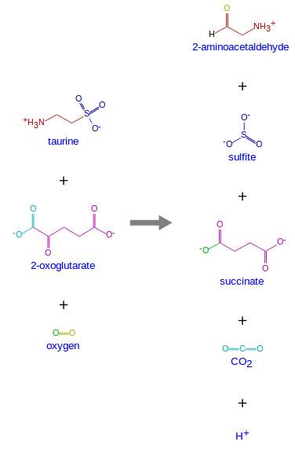
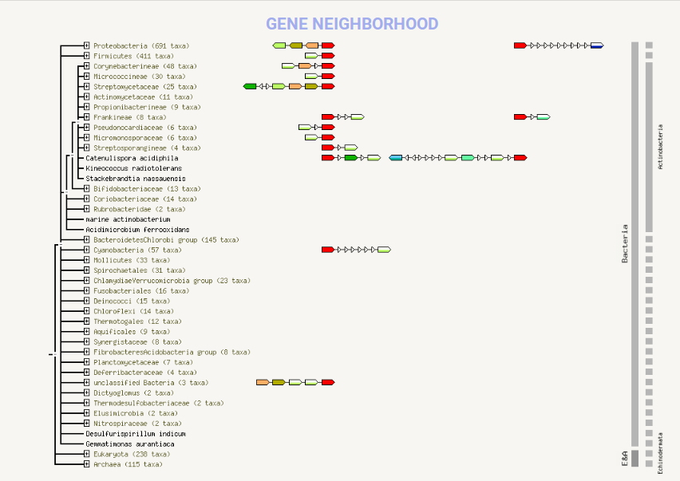

```{r setup, include=FALSE}
knitr::opts_chunk$set(echo = TRUE)
```

## vacaciones jaja


### TauD  
E.C. 1.14.11.17 TauABCD is en E.coli operon related to sulfur asimilation from Taurine  that was discovered under sulfur starvation. tauD is involved in the oxygenolytic release of sulfite from taurine. PLOEG 1996
On E coli Taurine pathway is an alternative  to cysteine pathwayfor sulfur assimilation 
{width=30%}
{width=30%}  

{width=30%}  
TauD KEGG reaction  
Taurine + 2-Oxoglutarate + Oxygen <=> Sulfite + Aminoacetaldehyde + Succinate + CO2

TauD is a broad substrate enzyme Taurine (25–500 μm) 	55 	4.1
MOPS (25–2000 μm) 	145 	2.0
1,3-Dioxo-2-isoindolineethanesulfonic acid (50–2000 μm) 	485 	3.8
Butanesulfonic acid (300–4000 μm) 	1490 	1.3
Pentanesulfonic acid (70–20 00 μm) 	590 	1.9
Hexanesulfonic acid (300–3000 μm)

Eric Eichhorn 1997 
TauABC son necesarios para la incorporcion de Taurina
two systems for alkanesulfonate uptake and metabolism are available in E. coli, with TauABCD being specifically involved in uptake and desulfonation of taurine and SsuEADCB being an uptake and desulfonation system for a wide range of alkanesulfonates other than taurine.  
Eric Eichhorn 2000  
la taurina tambien puede ser utilizada por su nitrógeno.
productos reclutados 17


Bacteria   Actinobacteria Polyketidetetronasin
Terpenepentalenolactone
Saccharide / Terpenephenalinolactone
Terpenepentalenolactone
Saccharidespectinomycin
NRP / Polyketidekirromycin
Terpeneplatensimycin / platencin
Terpeneplatensimycin / platencin
Terpeneplatencin
Polyketidelobophorin
Polyketidelobophorin
Othertabtoxin

Bacteria:Proteobacteria:
NRP / Polyketidebactobolin
NRP2-amino-4-methoxy-trans-3-butenoic acid

Fungi
Polyketidecommunesin
Fungi:ascomycetes:Polyketidecommunesin

### R	
Course  

### MicroSafari	 
Myxobacteria
Slime labirinth
Day and Night
### Tesis	

### Software  Carpentry
Preparar curso  

### Maven	 
Gabor

### Sat	

### BIRS
Hacer seminario, y de clavigenomics

Deborah  

	pangenome								
	Adri								
	Debora		
	Curriculum

-Antibióticos
-Enrique
-R
-Vikingómicos
-$$ Secretaría inovación  
Holbox QRoo  
dron lugares ácidos plantas del desierto, tomats silvistres, todas las clvF todas las priA
Manialtepec Oaxaca  
Chavahua Oaxaca  
Bucerías nayarit  
Xpicob campeche  
Cenote obscuro  
Reservas de la biósfera de México  