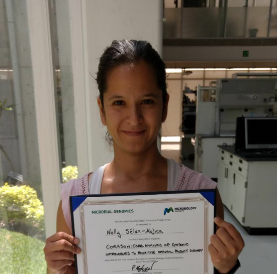

```{r setup, include=FALSE}
knitr::opts_chunk$set(echo = TRUE)

```

<!-- -->

# Nelly Sélem Mojica.  
nselem84@gmail.com, (+52) 462 132 64 07,  
Estudiante de cuarto año de doctorado en Biología integrativa.  
Langebio-Cinvestav, laboratorio de evolución de la diversidad metabólica.   

## Información profesional 
2012 - 2013 Desarrolladora bioinformática en LANGEBIO (Laboratorio Nacional de genómica para la biodiversidad)  
2010 - 2012 Profesora de matemáticas y desarrolladora de software educativo en el Instituto Politécnico Nacional.

## Educación  
- Estudiante de doctorado de Biología integrativa desde 2014. Langebio Cinvestav Irapuato.  
- Maestría en matemáticas. 2010 CIMAT Guanajuato,México.  
- Licenciada en matemáticas. 2006 Univesidad de Guanajuato.  
- Técnico Laboratorista clínico. 1999 CBTis 56, Iguala; Guerrero.  

## Artículos publicados  
1. Cellular ``bauplans'': Evolving unicellular forms by means of Julia sets and Pickover biomorphs. Nelly Selem Mojica and Jorge Navarro and Pedro C. Marijuan and Rafael Lahoz-Beltra. Biosystems, 98(1):19-30, 2009 https://doi.org/10.1016/j.biosystems.2009.07.002  

2. Phylogenomic Analysis of Natural Products Biosynthetic Gene Clusters Allows Discovery of Arseno-Organic Metabolites in Model Streptomycetes. Cruz-Morales P, Kopp JF, Martínez-Guerrero C, Yáñez-Guerra LA, Selem-Mojica N, Ramos-Aboites H, Feldmann J, Barona-Gómez F. Genome Biol Evol. 2016 Jul 2;8(6):1906-16. doi: 10.1093/gbe/evw125. http://gbe.oxfordjournals.org/content/8/6/1906  

3. Actinobacteria phylogenomics, selective isolation from an iron oligotrophic environment and siderophore functional characterization, unveil novel desferrioxamine molecular ecological and functional traits. Pablo Cruz-Morales  Hilda E. Ramos-Aboites  Cuauhtémoc Licona-Cassani Nelly Selem-Mójica  Paulina M. Mejía-Ponce  Valeria Souza-Saldívar Francisco Barona-Gómez. FEMS Microbiology Ecology, Volume 93, Issue 9, 1 September 2017, fix086, https://doi.org/10.1093/femsec/fix086   

4. Expanding Primary Metabolism Helps Generate the Metabolic Robustness To Facilitate Antibiotic Biosynthesis in Streptomyces. Jana K. Schniete, Pablo Cruz-Morales, Nelly Selem-Mojica, Lorena T. Fernández-Martínez, Iain S. Hunter, Francisco Barona-Gómez, Paul A. Hoskisson. Mbio 2018. https://doi.org/10.1128/MBIO.02283-17  

5. Whole genome sequencing reveals widespread distribution of typhoidal toxin genes and VirB/D4 plasmids in bovine-associated nontyphoidal Salmonella.  Enrique Jesús Delgado-Suárez, , Nelly Selem-Mojica, Rocío Ortíz-López, Wondwossen A. Gebreyes, Marc W. Allard, Francisco Barona-Gómez, and María Salud Rubio-Lozano. Scientific Reports: Decision letter for SREP-18-05404B  

## Artículos sometidos  
1. The cycad coralloid root contains a diverse endophytic bacterial community with novel biosynthetic gene clusters unique to its microbiome. Angelica Cibrian Jaramillo, Pablo Cruz-Morales, Antonio Corona-Gomez, Nelly Selem-Mojica, Miguel A. Perez-Farrera, Francisco Barona-Gomez, doi: https://doi.org/10.1101/121160   
  

## Artículos en Borrador
1. Evolution of multi-functionality imposes strong canalization of evolutionary trajectories and limits Darwinian evolution. Lianet Noda-García, Ernesto A. Verduzco-Castro, Nelly Sélem-Mojica & Francisco Barona-Gómez  
  
2. CORASON: CORe Analysis of Syntenic Orthologs to Prioritize Natural Products Biosynthetic Gene Glusters
by Sélem-Mojica Nelly, Cruz-Morales Pablo, Mejía-Ponce Paulina, Aguilar César, Ramos-Aboytes Hilda and Barona-Gomez Francisco  

3. EvoMining 2.0 Evolutionary reconstructions during genome mining. César Aguilar, Nelly Selem-Mojica and Francisco Barona-Gómez  
  
4. An exploration of tRNA-utilizing enzymes using EvoMining reveals novel BGCs in Actinobacteria. Paulina M. Mejía-Ponce, César Aguilar, Nelly Selem-Mojica, Hilda E. Ramos-Aboites, Pablo Cruz-Morales and Francisco Barona-Gómez  

## Distinciones recientes:  
- 2017 1° Microbiology society prize durante el congreso internacional de Biología de Actinobacteria en Jeju, Corea  
- 2017 BIRS invited speaker at CMO workshop Challenges and Synergies in the Analysis of Large-Scale Population-Based Biomedical Data  
- Ganadora del programa Nebula 2017 de la asociación Guanajuato colabora con el proyecto MicroZoo.    
- Becaria de la Secretaria de inovacion a estudiantes destacados de posgrado con atividades empresariales.    
- 2014 Ganadora del Google Summer of code GSoC2014 (verano de código de google) desarollando mi propuesta de problemas de genómica y biomatemáticas en WebWork, plataforma open source en perl de problemas de ciencias que se autoevalúan. 

## Actividades empresariales  
- Miembro fundador de DNAbits empresa ganadora del programa del parque Agrobioteg: emprendedores en bionegocios.  
- Administradora y miembro del consejo Bandits-León Ice Hockey Club.  

## Estancias, Talleres y congresos
- 2018 Ponente en Software tools for mathematics. Morelia, Michoacán.  
- 2017 Ponente de BIRS en la Casa Matemática de Oaxaca en el taller: Challenges and Synergies in the Analysis of Large-Scale Population-Based Biomedical Data.    
- 2017 Estancia de investigación en el grupo de Marnix Medema en Wageningen University and Research  
- 2017 Curso de Genómica microbiana de Asociación Mexicana de Microbiología (Instructora)  
- 2017 Software carpentry Certificación de instructor.  
- 2017 Nebula guanajuato colabora. Proyecto MicroZoo.  
- 2017 ISBA International Symposium of Biology of Actinobacteria, Jeju Corea.  
- 2016 Software carpentry. LANGEBIO, México.  (Asistente)  
- 2015 Anotación y genome mining RAST y Patric. Argonne National Laboratory.  
- 2014 SPI Taller de solución de problemas industriales. CIMAT.   
- 2012 Introducción a Mathematica y su uso en el Área de Cómputo en Paralelo - HPC. ISUM México  
- 2012 Computational cell biology Cold Spring Harbor Laboratory.   
- 2011 New Orleans WeBWork consultant Workshop.  
- 2011 Taller de estrategias didácticas para la enseñanza de las ciencias básicas para ingenieria  
- 2011 Implementaciones de unidades de aprendizaje para la modalidad virtual mediante moodle  
  
## Distinciones anteriores
- Trabajo de tesis con honores 2005: “Complex Variable applied to a cellular model using a genetic algorithm”  
- 2º lugar olimpiada mexicana de matemáticas 1999 México   
- 2º lugar olimpiada centroamericana y del caribe de matemáticas 1999 Costa Rica   
- 1° Premio al desarrollo académico de la juventud en el estado de Guerrero 1999 México   
- 1° Concurso Nacional de ensayo "La ciencia para todos" 1999 México   
- 2° concurso nacional de Biología CONACIBA 1998 México  
- 15 años en la selección nacional de Hockey. 4° Colombia 2012, World  inline hockey championships.   
- Bicampeona panamericana Selección nacional de hockey sobre hielo. 
  
# Desarrollo de Software  
## EvoMining  
Desarrollo de la plataforma EvoMining de minería de datos genómicos, disponible en https://github.com/nselem/EvoMining/wiki
 

## CORASON  
Desarrollo de plataforma de búsqueda y priorización de clusters biosintéticos, disponible en https://github.com/nselem/EvoDivMet/wiki

## Clavisual
Desarrollo de plataforma privada de búsqueda de genes marcadores de  endosimbionetes de tomate  
  

# Difusion de la ciencia    
## Difusión de ciencia a científicos
###Unam Taller de Genoma Bacteriano    
En la Unam ENES, unidad León en la carrera de Ciencias Agrogenómicas di un taller acerca del genoma bacteriano. Comparamos diversos genomas de la misma especie, y vimos que diferían en el contenido génico, así introdujimos los conceptos de pangenoma y coregenome. Utilizamos el anotador genómico RAST y los lenguajes de programación PHP y MySQL.  

###Software-Carpentry Workshop  
Mayo 30,31 Junio 8,9 2016  
Participé como instructor en el curso de software carpentry de introducción al cómputo científico.
http://liz-fernandez.github.io/2016-06-08-LANGEBIO-Mexico/  

###Descripción de actividades  
http://www.cyverse.org/blog/events/cyverse-tools-and-services-data-carpentry-workshop-langebio-cinvestav-irapuato-mx-may-30  

Enseñamos a científicos a hacer su trabajo bioinformático organizado, eficiente y replicable con herramientas como R, linux, docker y atmosphere.  

##Difusión de ciencia al público general  
1. Semana de la ciencia del colegio del Bosque 2017   
2. Niños y Jóvenes en la Ciencia ciclo 2015-2016 SICES  
3. Taller el microbioma te acompaña CIMAT 2016  
4. Día abierto CINVESTAV 23 Semana Nacional de ciencia y tecnología 2016  
5. Profesor ayudante de Clubes de Ciencia México 2014 (Este proyecto ganó el tercer lugar en la competencia de inovación educativa en la escuela de graduados de Harvard). 

## Agradecimientos recibidos en artículos publicados    
- Espinosa-Cantú, A., Ascencio, D., Barona-Gómez, F., & DeLuna, A. (2015). Gene duplication and the evolution of moonlighting proteins. Frontiers in Genetics, 6, 227. http://doi.org/10.3389/fgene.2015.00227  
  
- Ana Lilia Juárez-Vázquez et al (2017) Evolution of substrate specificity in a retained enzyme driven by gene loss. E-life DOI: 10.7554/eLife.22679   

- Lianet Noda-García, Ana L. Juárez-Vázquez, María C. Ávila-Arcos, Ernesto A. Verduzco-Castro, Gabriela Montero-Morán, Paul Gaytán, Mauricio Carrillo-Tripp and Francisco Barona-Gómez.Insights into the evolution of enzyme substrate promiscuity after the discovery of $\beta\alpha_8$ isomerase evolutionary intermediates from a diverse metagenome. BMC Evolutionary Biology 2015.  

- Karina Gutiérrez-García, Adriana Neira-González, Rosa Martha Pérez-Gutiérrez, Giovana Granados-Ramírez, Ramon Zarraga, Kazimierz Wrobel, Francisco Barona-Gómez and Luis B. Flores-Cotera. Phylogenomics of 2,4-Diacetylphloroglucinol-Producing Pseudomonas and Novel Antiglycation Endophytes from Piper auritum. J. Nat. Prod., 2017, 80 (7), pp 1955–1963. DOI: 10.1021/acs.jnatprod.6b00823  